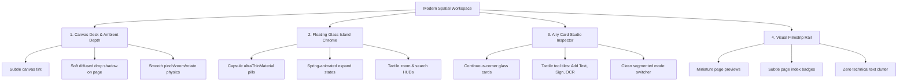

# Northstar — Modern Spatial Workspace Vision & Blueprint

> **Status (2026-09-17, per D-083):** aspiration blueprint (T0) — an owner-directed design
> proposition. Not status authority (D-055: task state lives in `docs/task-inventory.md`, gate
> state in `docs/release-gates.md`) and not evidence of shipped state. The pillars proceed as
> D-083's **parallel styling track**: styling on existing surfaces, each shipping only with
> MAD-R1/R2 accessibility and human-visual gate evidence. The agentic spine is governed by
> D-078 + D-083's slice sequence (NM-T41…NM-T45), not by this document.

> **Restatement (2026-09-22, D-083 Amendment 1):** "styling on existing surfaces" means
> **chrome restructuring + hierarchy**, not re-skin in place — toolbar demotion (MAD-006),
> inspector two-tier hierarchy (MAD-007), rail declutter (pillar 4), page paper elevation
> (pillar 1), on an accessibility substrate; MAD-008 (reduce-transparency/contrast handling)
> closes first on every touched surface. First tranche landed 2026-09-22: rail diagnostic
> declutter + selected-card accent halo (pillar 4), native PDFKit page shadows (pillar 1 —
> hairline page borders are not exposed by PDFKit and are deliberately not faked), and
> reduce-transparency fallbacks on the canvas HUD islands. Before/after captures:
> `docs/audits/screenshots/2026-09-22_workspace_before_canvas.png`,
> `docs/audits/screenshots/2026-09-22_workspace_after_canvas.png`.

> **Mission:** Transform Northstar from a cramped, 20-year-old utility PDF reader into a modern, calm, spatial document workbench. The start/welcome workspace already embodies this clean, contemporary ethos; this document codifies how that same breathing room, physical presence, visual hierarchy, and tactile affordance extends across the active document canvas, inspector, and navigation surfaces.

---

## 1. Executive Summary & Root Problem

### The User Critique
> *"the start workspace/welcome is so clean and beautiful and functional, the rest are dull and cramped and not the new age i wanted...its the same 20 year old pdf reader as everyone else's"*
> *"the files dont render any content at all"*

### What Went Wrong in the Legacy Paradigm
1. **The Blank Canvas Breakdown (Fixed):** An experimental progressive tile pipeline (`usePipelineRendering = true`) was instantiating unconstrained, zero-sized subviews that produced zero pixels, leaving the central canvas a stark, completely blank white void.
2. **The 2004 Utility Syndrome:** Traditional PDF readers (Acrobat, Preview, Foxit) treat the document like an immovable digital photocopy trapped between gray, dense, tabular toolbars and rigid splitter panels. Controls are clustered, buttons lack tactile depth, and the workspace feels claustrophobic and mechanical rather than creative and focused.

### The New-Age Northstar Philosophy
Northstar should feel like a **physical drafting desk in a modern studio**:
- The document has **tangible weight and ambient presence**.
- Controls **float lightly above the work** in translucent glass islands, appearing when needed and never suffocating the content.
- The sidebar is not a spreadsheet of technical diagnostics; it is an **intelligent, airy card studio**.
- Navigation is a **visual filmstrip**, letting you feel the progression of pages rather than reading row metadata.

---

## 2. The Four Pillars of the Modern Workspace

---

## 3. Pillar Breakdown & Design Specifications

### Pillar 1: Canvas Desk & Ambient Depth
Instead of a harsh white PDF page slapped edge-to-edge against a generic grey window:
* **The Desk (Canvas Surface):** The background canvas uses Apple's native system window background with subtle adaptive depth (`.windowBackgroundColor` / `.background(.quaternary.opacity(0.15))`).
* **The Paper (Physical Presence):** The PDF sheet is elevated off the desk with a delicate, continuous border (`0.5pt Color.black.opacity(0.06)`) and a multi-stage ambient drop shadow:
  $$\text{Shadow: } \text{color: } \text{rgba}(0,0,0,0.08), \text{radius: } 20\text{pt}, y: 8\text{pt}$$
  This gives the page physical presence, making text and typography pop with crisp clarity.
* **Seamless Responsive Zooming:** Smooth spring transitions between **Fit Width**, **Fit Page**, and explicit zoom increments without visual stutter.

### Pillar 2: Floating Glass Island Controls
Eliminate the cluttered, top-heavy rows of utility buttons that have dominated PDF software since 1993:
* **Bottom Island (Canvas Navigation & View Control):**
  - Sleek, floating capsule pill centered or docked bottom-right.
  - Formed from `.ultraThinMaterial` / `.regularMaterial` with high-contrast hairline borders (`Color.white.opacity(0.2)` in dark mode, `Color.black.opacity(0.1)` in light mode).
  - Tactile zoom stepper (`-`, interactive percentage popover, `+`) and 90° rotation triggers with haptic-responsive tap feedback.
* **Top Island (Omni-Find & Action HUD):**
  - Collapsed into an elegant capsule chip (`⌘F Find`).
  - Smoothly expands via spring animation into an interactive search and query HUD with real-time match counters and match stepping chevrons.

### Pillar 3: Airy Card Studio Inspector (Right Panel)
Transform the technical inspector into a calm, context-aware companion:
* **Segmented Section Switcher:** Clean macOS segmented control with `.labelsHidden()` to eradicate awkward text wrapping, seamlessly switching between:
  - **Complete:** Smart form fill, manual text placement, signature stamp, and OCR tools.
  - **Understand:** AI/local document summarization, entity recognition, and key points.
  - **Organize:** Page reordering, rotation, deletion, and extraction.
  - **Reader:** Study/review layouts, typography options, and reading modes.
  - **Review:** Provenance evidence, sanitization audit trail, and signature attestation.
* **Tactile Tool Tiles:** Replace flat, gray buttons with modern action tiles featuring distinct icon badges, spring hover micro-interactions, and clear state indicators.
* **Elevated Metric & Evidence Cards:** Rounded cards (`cornerRadius: 12, .continuous`) with subtle glassmorphic material, clean 14pt typography, and accent-tinted status badges (`EVIDENCE`, `SAFE TO SIGN`) plus scoped, count-backed check badges (e.g. `7 CHECKS PASSED`) — never absolute-state badges like `100% COMPLIANT` (claim discipline: D-067/PL-I12; council review 2026-09-17).

### Pillar 4: Visual Filmstrip Rail (Left Panel)
Make page navigation feel like scrolling through a high-end photography or design studio:
* **Visual First:** Generous miniature page thumbnails rendered directly from the document raster cache.
* **Decluttering:** Eliminate raw technical character counts and geometric coordinate dimensions from the default view.
* **Contextual Badges:** Only show elegant, color-coded semantic pills when relevant:
  - Blue capsule: `3 fields`
  - Orange capsule: `2 suggestions`
  - Purple capsule: `1 signature`
* **Active State:** Soft accent halo ring around the selected page card with spring-animated selection indicator.

---

## 4. Observed Resolution (one-shot capture — not a verification gate)

The rendering fix was implemented and observed with a live macOS window capture on 2026-09-06:
1. **Pipeline Toggle Disabled:** `usePipelineRendering` was set to `false` in `AppModel.swift:623`, ensuring that `DocumentCanvasView` mounts native `PDFKitView` (`InteractivePDFView`).
2. **Defensive Layout:** Subview zero-frame traps were eliminated.
3. **Live Rendering Observation:** When launched with real PDF fixtures (e.g. `plain-text.pdf`), page text ("Heading Two", paragraphs, and formatting) rendered through the native PDFKit view in the captured session. This is a one-shot observation — no repeatable fidelity oracle exists; per-fixture fidelity claims remain governed by D-076's `production_ready`/`experimental` tiers. (Previously stated as "100% native vector fidelity" — restated 2026-09-17 per D-067/council claim discipline.)

---

## 5. Next Phase Execution Plan

| Phase | Target Surface | Architectural Scope | Status |
| :--- | :--- | :--- | :--- |
| **Phase 1** | Canvas Content Rendering | Fix zero-frame pipeline bug and route native PDFKit renderer | **Complete** |
| **Phase 2** | Canvas Physical Desk | Ambient drop shadow, soft desk background, physical page border | **Ready to Execute** |
| **Phase 3** | Floating Glass Islands | Modernize Floating Canvas HUD and Search HUD with spring transitions | **Ready to Execute** |
| **Phase 4** | Card Studio Inspector | Refactor `ContextualInspectorView` action tiles and elevated cards | **Ready to Execute** |
| **Phase 5** | Visual Filmstrip Rail | Clean thumbnail cards, remove raw coordinate noise, add active halos | **Ready to Execute** |
