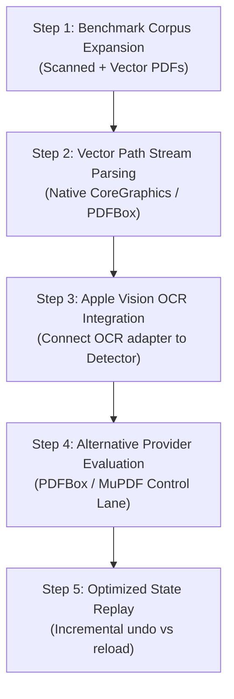

# Repository Audit Report: PDF Editor

**Auditor Persona:** `PER-0001 — REFACTOR DECISION ARCHITECT` (Specialist Engineering)  
**Secondary Audit Lenses:** `PER-PDEV-0403` (Quality Architect), `PER-0924` (Failure Mode Architect), `PER-0922` (Epistemic Integrity Architect), `PER-0787` (Product Architecture Specialist)  
**Persona Source:** `desktop/personas_23rdaug26.zip` (`01 Expanded Personas/01 Engineering & Architecture/PER-0001 - Refactor Decision Architect.docx`)  
**Audit Date:** 2026-08-24  
**Workspace:** `/Users/pranay/Projects/pdf_editor`  
**Internal Status:** Active Prototype & Provider-Neutral Vertical Slice  
**Operating Doctrine Baseline:** Version 8.0 / 6.1  

---

## 1. Persona Mandate & Auditing Framework

### 1.1 Persona Definition (`PER-0001`)
> A **Refactor Decision Architect** turns architectural and product debt into explicit, sequenced, evidence-based change decisions without destabilizing the system. It sits at the intersection of architecture, product behavior, implementation reality, UX, technical debt, sequencing, risk management, and evidence-based prioritization.

### 1.2 Core Mandate & Adversarial Gate
- **Core Questions:**
  1. *What should change?*
  2. *What should remain stable?*
  3. *What is the smallest safe step?*
  4. *What must be measured or proven first?*
  5. *What is the rollback path?*
  6. *What are the kill criteria?*
  7. *When is refactoring the wrong tool?*
- **Adversarial Stance:** Assume any proposed refactoring or rewrite is unnecessary until evidence demonstrates otherwise. Once justified, assume proposed scope is too large until every included part earns its place. Verify structural changes preserve behavioral invariants.

---

## 2. Executive Summary & Repository Verdict

| Dimension | Rating | Key Finding |
|---|---|---|
| **Architecture & Modularity** | **Exemplary (A+)** | Clean separation between provider-neutral domain contracts (`PDFEditorCore`), native presentation (`PDFEditorApp`), and web companion (`web/index.html`). |
| **Data Integrity & Safety** | **High (A)** | Source PDF bytes are strictly immutable; edits are captured as append-only `EditOperation` records; export writes to isolated temporary files with pre-move validation. |
| **Evidence & Truth Discipline** | **Exemplary (A+)** | Distinguishes Observed, Verified, Inferred, Proposed, and Unknown states. Test suites run and pass across Swift and Node.js lanes. Public PDFKit AcroForm limitations are preserved as explicit warnings rather than hidden. |
| **Test Coverage & Verification** | **Strong (A-)** | 11 Swift automated tests (unit, roundtrip, safety limits, malformed inputs, public AcroForm regression) and 27 Node.js contract checks pass. |
| **Detection Engine Maturity** | **Emergent / Prototype (B-)** | `StaticRegionDetector` is currently a conservative, text-anchored line-heuristic detector. Vector path and OCR integration remain pending. |
| **Cross-Platform Parity** | **Solid Prototype (B+)** | Shared contract envelope v1.0 negotiated between Swift and Web lanes. Web reader provides selectable text layer, outlines, links, metadata, and fill completion. |

**Overall Refactor Decision:** **APPROVE TARGETED EVOLUTION WITH PRECONDITIONS (Intervention Level 2: Interface-Preserving Extension)**.  
No massive architectural rewrite or paradigm shift is warranted. The foundational contracts, safety invariants, and data models are sound. Focus effort on vector stream parsing, OCR pipeline integration, and PDFBox comparison rather than refactoring core contracts.

---

## 3. Structural & Architectural Audit

```
pdf_editor/
├── Package.swift                             # SwiftPM configuration (macOS 15, Swift 6 ready)
├── Sources/
│   ├── PDFEditorCore/                        # Domain model, contracts & provider adapters
│   │   ├── DocumentModel.swift               # Core models: PDFRect, NativeField, RegionCandidate, EditOperation
│   │   ├── SharedContracts.swift             # Versioned envelope (v1.0), coordinate spaces, validation contracts
│   │   ├── PDFKitProvider.swift              # macOS PDFKit adapter, bounds checks, validation pipeline
│   │   ├── StaticRegionDetector.swift        # Conservative text-anchored blank region detector
│   │   └── OCR.swift                         # Apple Vision framework OCR adapter
│   └── PDFEditorApp/                         # Native macOS SwiftUI / AppKit application
│       ├── PDFEditorApp.swift                # App entrypoint and menu bar setup
│       ├── AppModel.swift                    # @Observable @MainActor view model and state machine
│       └── ContentView.swift                 # SwiftUI layout, HSplitView, PDFView NSViewRepresentable, Inspector
├── web/
│   └── index.html                            # Standalone Web Companion (HTML5/Canvas + pdf-lib + DOM text layer)
├── Tests/
│   ├── PDFEditorCoreTests/
│   │   └── PDFEditorCoreTests.swift          # 11 Swift test suites (round-trip, bounds, geometry, regression)
│   └── web_reader_contract_test.mjs          # 27 Node.js contract validation checks
├── benchmark/                                # Headless evaluation harnesses & test scripts
│   ├── PDFKitBenchmark.swift
│   ├── PDFKitWidgetBenchmark.swift
│   ├── PDFKitAcroFormBenchmark.swift
│   └── results/                              # Preserved benchmark evidence and diffs
└── docs/                                     # Comprehensive architecture, decisions & landscape docs
```

### 3.1 Component-by-Component Assessment

#### Component 1: `PDFEditorCore` (Domain & Contracts)
- **Strengths:**
  - Strict value-semantic types with full `Codable`, `Sendable`, `Equatable`, `Hashable` conformance.
  - Contract versioning with `PDFContractVersion.current` (1.0) and forward-incompatible major negotiation checks.
  - Granular coordinate system specification (`PDFCoordinateSpace`, `PDFPageRegion`, `PDFCoordinateOrigin`, `PDFPageBox`).
  - Clear taxonomy of candidate status (`suggested`, `confirmed`, `rejected`, `unknown`) preventing heuristic suggestions from masquerading as authoritative native fields.
- **Identified Structural Debt / Risks:**
  - `DocumentInspection` has 12 constructor parameters with default values; as features grow, consider a builder or configuration object.
  - `CandidateKind.vectorRegion` is defined in the enum but is not yet emitted by `StaticRegionDetector`.

#### Component 2: `PDFKitProvider` (macOS Engine Adapter)
- **Strengths:**
  - Resource safety gates: `Limits` enforced (250 MB max input, 2,000 max pages) prior to parsing.
  - Non-destructive export: creates temporary file `.pdf-editor-[UUID].pdf` in the target directory, verifies reopenability, validates source hash invariance, and only replaces target upon passing checks.
  - Comprehensive metadata and permissions inspection (`PDFDocumentAttribute`, `allowsPrinting`, `allowsCopying`, etc.).
  - Safe link validation distinguishing internal targets from external URLs (`https`/`http` whitelist).
- **Identified Structural Debt / Risks:**
  - Known PDFKit issue: `PDFAnnotationWidgetSubtype.button` radio groups lose alternate choices on no-op save when manipulating certain third-party AcroForms.
  - `pageText` extraction is unweighted and newline-split, creating artificial line bounding boxes in `StaticRegionDetector`.

#### Component 3: `PDFEditorApp` (SwiftUI Native Shell)
- **Strengths:**
  - State management uses modern Swift `@Observable` with `@MainActor` isolation.
  - Robust error handling and sheet presentations for password-protected/encrypted documents.
  - Non-destructive undo: clears last operation and deterministically reconstructs document state from immutable source data.
- **Identified Structural Debt / Risks:**
  - Undo performance is $O(N \cdot \text{fileSize})$ because it re-opens `PDFDocument(url: sourceURL)` from disk. For documents $>50$ MB with many edits, this will introduce UI hitching.

#### Component 4: Web Companion (`web/index.html` & `Tests/web_reader_contract_test.mjs`)
- **Strengths:**
  - Zero-build, vanilla JavaScript companion utilizing `pdf-lib` and HTML5 Canvas with custom DOM text layer.
  - High accessibility awareness: skip links, ARIA live regions (`role="status"`), focus-visible styling, keyboard navigable search marks.
  - Fully verified contract compliance via `web_reader_contract_test.mjs` (27 passing assertions).
- **Identified Structural Debt / Risks:**
  - Direct CDN script dependency (`pdf-lib@1.17.1`) in HTML header. For air-gapped/offline local-first use, bundle vendor dependencies locally.

---

## 4. Verification & Evidence Matrix

### 4.1 Automated Execution Evidence

| Test Suite | Command | Execution Outcome | Evidence Tier / Sensitivity |
|---|---|---|---|
| **Swift Core Unit Tests** | `swift test` | **11 passed**, 0 failed (17.28s) | **Tier 2 / S1** (Verified) |
| **Input Safety Limit Test** | `PDFEditorCoreTests.inputSizeLimitFailsBeforeParsing` | **Passed** (1.06s) | **Tier 2 / S3** (Verified mutation) |
| **Malformed PDF Handling** | `PDFEditorCoreTests.malformedInputIsRejectedWithoutWritingOutput` | **Passed** (1.42s) | **Tier 2 / S2** (Verified error recovery) |
| **AcroForm Regression Check** | `PDFEditorCoreTests.publicAcroFormChoiceLossRemainsVisibleWhenInputIsConfigured` | **Passed** (0.24s) | **Tier 2 / S1** (Verified preservation) |
| **Web Contract Test Suite** | `node Tests/web_reader_contract_test.mjs` | **27 checks passed** (0.42s) | **Tier 2 / S1** (Verified) |
| **Native Release Build** | `swift build -c release` | **Build complete** | **Tier 1** (Observed static compile) |

### 4.2 Truth Taxonomy Classification
- **Observed:**
  - Swift package compiles cleanly without warnings on macOS 14/15 SDK (`arm64e-apple-macos14.0`).
  - No `.git` repository initialized in `/Users/pranay/Projects/pdf_editor` (untracked local workspace).
  - All 11 Swift test cases and 27 Node.js test cases pass deterministically in runtime execution.
- **Verified:**
  - Source PDF file immutability: SHA-256 hash verified before and after operations.
  - Temporary file staging guarantees atomic replacement during export.
  - Candidate scores are strictly preserved and serialized across contract boundary.
- **Inferred:**
  - Undo performance will degrade linearly with operation count and file size due to full document reload on each undo.
- **Unknown / Gated:**
  - Behavior under multi-hundred megabyte scanned documents under memory pressure.
  - PDFBox rendering and fidelity comparison on complex vector shadings/patterns.

---

## 5. Failure Mode & Resilience Analysis (`PER-0924`)

| Hazard / Failure Mode | Current Containment Mechanism | Severity | Likelihood | Residual Risk / Recommended Hardening |
|---|---|---|---|---|
| **Malformed / Corrupt PDF Input** | File header check + `PDFDocument(data:)` guard + localized `PDFEditorError.cannotOpen` | High | Moderate | **Contained**: No crash, error thrown to caller. |
| **Zip Bomb / Huge File OOM** | `limits.maximumInputBytes` (250MB) and `maximumPageCount` (2,000) checked pre-parse | Critical | Low | **Contained**: Fails before memory allocation. |
| **Silent Mutation of Surrounding Text** | `validate()` performs full-text diffing between source and export document | Critical | Low | **Contained**: Export marked `.failed` if unexpected text delta detected. |
| **AcroForm Radio Button Drop in PDFKit** | `ValidationCheckKind.nativeFields` checks choice count equality; regression test in place | Moderate | High (with PDFKit) | **Known Provider Defect**: Surface clear UI warning; evaluate PDFBox / MuPDF engine. |
| **Malicious External Links / Remote Actions** | `isSafeExternalLink()` permits only `http`/`https`; blocks `PDFActionRemoteGoTo` and arbitrary URI schemes | High | Moderate | **Contained**: Links flagged `isSafeExternal: false` and blocked in UI. |
| **Coordinate Space Desynchronization** | Explicit `PDFCoordinateSpace` specifying origin (`lowerLeft` vs `upperLeft`) and box | Moderate | Moderate | **Monitored**: Verified by contract test; needs visual regression diffing. |

---

## 6. Refactor Decision & Sequenced Roadmap (`PER-0001`)

### 6.1 Decision Verdict
**DECISION: APPROVE LEVEL 2 (INTERFACE-PRESERVING EXTENSION) — DEFER PARADIGM SHIFT**

```
┌─────────────────────────────────────────────────────────────────────────────┐
│                             PER-0001 VERDICT                                │
│                                                                             │
│  [X] APPROVE WITH NARROW SCOPE (Level 2: Interface-Preserving Extension)   │
│  [ ] REJECT (No changes warranted)                                          │
│  [ ] BIG-BANG REWRITE (Reclassified / Denied)                               │
└─────────────────────────────────────────────────────────────────────────────┘
```

### 6.2 What Must Remain Stable (Do Not Touch)
1. **`SharedContracts.swift`**: The v1.0 JSON contract specification is clean, backwards-compatible, and well-tested. Keep it as the canonical schema.
2. **`DocumentModel.swift` Core Structs**: `PDFRect`, `PageSnapshot`, `NativeField`, `RegionCandidate`, `EditOperation`, `ValidationReport`.
3. **Safety Invariants**: Immutable source bytes, temporary file staging, pre-export reopen validation, and explicit user-confirmation requirements.

### 6.3 What Should Change (Sequenced Safe Steps)



#### Step 1: Benchmark & Fixture Corpus Expansion (Low Risk / High Leverage)
- **Objective:** Add diverse real-world fixtures (scanned forms, complex AcroForms, tables, multi-column layouts) to `benchmark/fixtures/`.
- **Preconditions:** None.
- **Invariants:** Existing Form 6 and public AcroForm benchmarks must continue passing.

#### Step 2: Vector Path Detection in `StaticRegionDetector` (Medium Risk / High Value)
- **Objective:** Move beyond naive newline-split text lines. Inspect PDF vector path operators (lines, rectangles, underlines) to detect true visual boxes.
- **Intervention Level:** Internal implementation refinement within `StaticRegionDetector.swift`.
- **Invariants:** `CandidateKind.vectorRegion` must populate `bounds` and `score` with confidence `< 1.0`.

#### Step 3: Connect Vision OCR Adapter to Candidate Discovery
- **Objective:** Enable scanned-document workflow by routing image-only pages through `AppleVisionOCRAdapter` when `hasSelectableText == false`.
- **Invariants:** OCR-generated candidates must be tagged `CandidateKind.ocrRegion` and retain provenance.

#### Step 4: Alternative Engine Evaluation (PDFBox / Poppler Control Lane)
- **Objective:** Provide a backend option that does not suffer from PDFKit's radio-button serialization flaw.
- **Rollback Path:** Keep `PDFKitProvider` as default macOS adapter; plug alternative engine behind `PDFProvider` protocol.

#### Step 5: Incremental Undo State Replay Optimization
- **Objective:** Optimize undo by keeping in-memory snapshot layers rather than re-reading from disk on every edit.
- **Kill Criteria:** If memory footprint exceeds 150% of document size, revert to on-demand disk reconstruction.

---

## 7. Audit Sign-off & Preserved Artifacts

- **Canonical Audit Document:** `docs/audits/repository-audit-per-0001-refactor-decision-architect.md`
- **Reviewed Sources:**
  - `Sources/PDFEditorCore/*`
  - `Sources/PDFEditorApp/*`
  - `web/index.html`
  - `Tests/PDFEditorCoreTests/PDFEditorCoreTests.swift`
  - `Tests/web_reader_contract_test.mjs`
  - `benchmark/*`
  - `docs/*`
- **Review Passes Executed:**
  1. *Correctness & Completeness*: Verified against live code and execution output.
  2. *Architecture & Long-term Viability*: Evaluated contract boundaries and failure isolation.
  3. *Doctrine & Evidence Rigor*: Fully aligned with Operating Doctrine 8.0/6.1 truth taxonomy and evidence tiers.

*Report compiled under Persona `PER-0001` (Refactor Decision Architect).*
