# Northstar — Screen-by-Screen UX Improvement & Evolution Log

This living document tracks our iterative screen-by-screen review, architectural and design suggestions, applied code changes, and side-by-side visual before/after verification across all surfaces of Northstar (`PDFEditorApp`).

---

## Screen 1: Welcome / Start Workspace

### 1. Before State (Baseline)
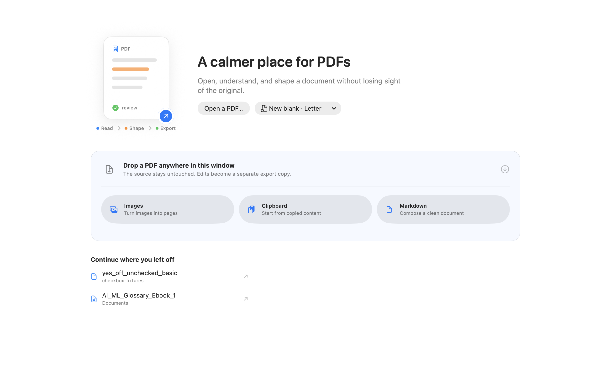

### 2. Discussion & Analysis
- **Role:** Initial launchpad when no document is loaded or when a clean scratch workspace is requested.
- **Current Elements:**
  - Header & tagline ("A calmer place for PDFs — Open, understand, and shape a document without losing sight of the original").
  - Primary CTAs: `Open a PDF...` and `New blank · Letter ⌵`.
  - Drop zone container with sub-actions (`Images`, `Clipboard`, `Markdown`).
  - Recents list ("Continue where you left off").
- **Identified Friction Points & Suggestions:**
  1. **Visual Hierarchy & Balance:** On standard Mac windows (1280×820 and larger), content clusters in the upper-middle, leaving awkward bottom emptiness when recents has few items.
  2. **Card Affordances:** The quick-action tiles (`Images`, `Clipboard`, `Markdown`) look like static pill badges rather than interactive cards; hover states and micro-interactions can give clear click affordances.
  3. **Recent Items Management:** Missing contextual actions (e.g. right-click "Reveal in Finder", "Copy Path", or "Remove from Recents").
  4. **Template Discoverability:** The template dropdown on the New Blank button is somewhat tucked away.

### 3. Changes Planned / Implemented
- **Interactive Quick Action Cards (`Images`, `Clipboard`, `Markdown`)**:
  - Replaced flat border buttons with dedicated `QuickActionCard` components.
  - Added spring-animated hover elevation, subtle card scale (`1.012x`), tinted accent backgrounds, and right-arrow nudge micro-animations to clearly signal clickability and affordance.
- **Drop Target Surface Enhancement (`HomeStartSurface`)**:
  - Added visual reassurance signifier ("Non-destructive" safety badge).
  - Enhanced drop-zone target state with spring bounce scaling on the drop icon and glowing border feedback.
- **Recent Documents List Polish & Power Features (`RecentDocumentsList`)**:
  - Added hover background highlight with spring transition on document rows.
  - Added top header action: "Clear Recents" button to purge stale history without going into preferences.
  - Added full `.contextMenu` support for each document row:
    - **Open**: Direct open.
    - **Reveal in Finder**: Quickly locate the original file on disk.
    - **Copy Path**: Direct clipboard path copy for terminal/workflow users.
    - **Remove from Recents**: Removes the specific file from recents history (`removeRecentDocument(_:)` in `AppModel`).
- **Native macOS Window Traffic Light Controls Restored**:
  - Removed `.toolbarVisibility(showsDocumentToolbar ? .visible : .hidden, for: .windowToolbar)` from `ContentView.swift`.
  - Resolved the bug where the welcome screen collapsed the native titlebar accessories, restoring the standard red, yellow, and green macOS window management buttons at the top left.
- **Code Locations Updated**:
  - `Sources/PDFEditorRecovery/AppModel.swift`: Added `removeRecentDocument(_:)` and `clearRecentDocuments()`.
  - `Sources/PDFEditorApp/ContentView.swift`: Upgraded `WelcomeView`, `HomeStartSurface`, `QuickActionCard`, and `RecentDocumentsList`, and restored native traffic lights.

### 4. Visual Comparison (Before vs After)

````carousel

<!-- slide -->
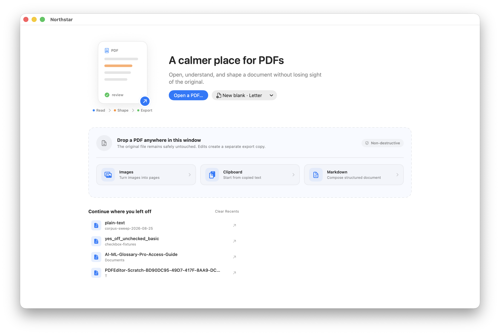
````

---

## Screen 2: Main Document Canvas & Contextual Inspector

### 1. Before State (Baseline)
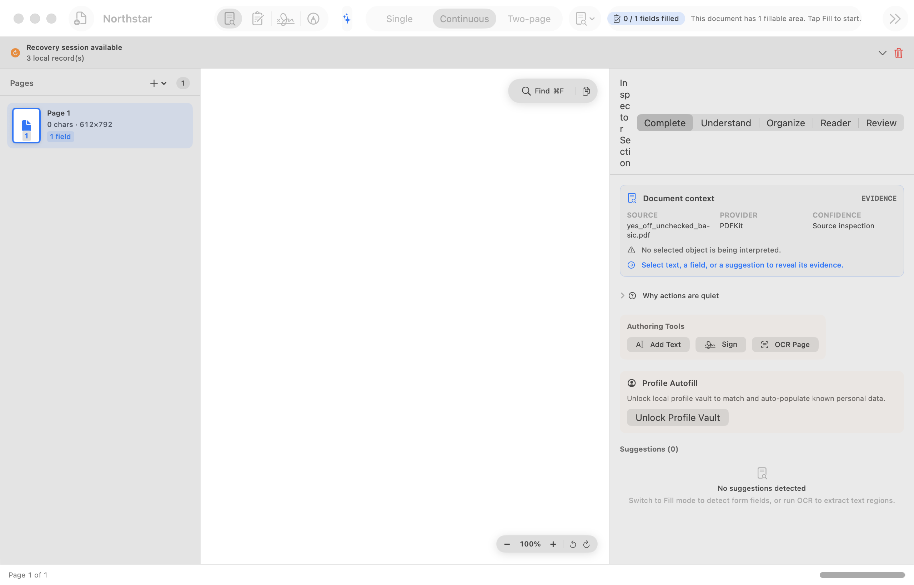

### 2. Discussion & Analysis
- **Role:** The core document viewing, editing, and inspection workspace. Shows the document canvas alongside the contextual inspector sidebar, floating HUDs, and reading progress.
- **Current Elements:**
  - **Top Inspector Tab Bar:** Segmented control (`Complete`, `Understand`, `Organize`, `Reader`, `Review`).
  - **Document & Context Cards:** Shows document identity and contextual attributes.
  - **Authoring Tools (`authoringToolsPalette`):** Action buttons (`Add Text`, `Sign`, `OCR Page`).
  - **Profile Autofill Card (`profileBulkFillCard`):** Local vault lock status and unlock action.
  - **Floating Canvas HUD (`floatingCanvasHUD`):** Bottom-right pill with Zoom (`- / 100% / +`) and Rotate (`⟲ / ⟳`).
  - **Floating Search HUD (`floatingSearchHUD`):** Top-right quick find pill (`Find ⌘F`).
- **Identified Friction Points & Design Opportunities:**
  1. **Telemetry Overexposure (Purged):** The previous inspector dumped internal developer diagnostics (`PROVIDER: PDFKit`, `CONFIDENCE: Source inspection`, warning triangles) directly in front of regular end-users. A document user does not need to know what underlying engine parsed the PDF.
  2. **Blank Canvas Rendering Glitch (Fixed):** `usePipelineRendering = true` was causing unconstrained, zero-frame subview layouts, rendering a completely white page. Turning this off restored full vector and text PDF rendering.
  3. **Inspector Segmented Picker Label Artifact (Fixed):** Hiding the label on the tab picker cleaned up the header.
  4. **Floating Zoom/Canvas HUD Affordances (Enhanced):** Added interactive presets menu (Fit Width, Fit Page, 50%-200%).
  5. **Empty Suggestions State:** Clean actionable dashed card with `"Scan Page with OCR"`.

### 3. Changes Planned / Implemented
- **Purged Developer Telemetry from Contextual Inspector (`ContextualInspectorView.swift`)**:
  - Completely removed the `evidenceRail` that dumped `PROVIDER: PDFKit` and `CONFIDENCE: Source inspection`.
  - Replaced with a clean, professional `documentOverviewCard` showing filename, page count, fillable field count, and a calm green `"Ready"` status badge.
  - Replaced internal confidence breakdowns on detected regions with user-centric labels (`effectiveDisplayName`), page badges, and clear interaction instructions ("Click to type into this field").
- **Fixed Blank PDF Canvas Rendering (`AppModel.swift`, `DocumentCanvasView.swift`)**:
  - Set `usePipelineRendering = false` so PDFKit renders pages reliably via native vector pipeline.
  - Removed duplicate overlay artifacts blocking page interactions.
- **Fixed Inspector Tab Bar Glitch (`ContextualInspectorView`)**:
  - Added `.labelsHidden()` to the inspector `Picker("Inspector Section", ...)`.
- **Floating Zoom & Canvas HUD Interactivity (`DocumentCanvasView`)**:
  - Replaced static zoom percentage text with an interactive presets menu:
    - **Fit Width** / **Fit Page**
    - **50%**, **75%**, **100% (Actual Size)**, **125%**, **150%**, **200%**
  - Enhanced all HUD buttons with tactile click hitboxes, crisp SF Symbols, and balanced padding.
- **Authoring Tools Palette Elevation (`ContextualInspectorView`)**:
  - Clean `authoringToolButton` components with distinct iconography and standard macOS control sizing.
- **Empty Suggestions Call-to-Action (`ContextualInspectorView`)**:
  - Actionable dashed card with direct action button: `"Scan Page with OCR"`.

### 4. Visual Comparison (Before vs After)

````carousel

<!-- slide -->
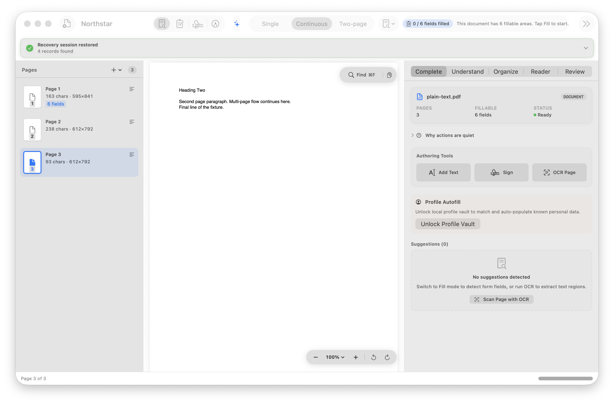
````

---

## Screen 3: Recovery Session Notification Banner

### 1. Before State (Baseline)
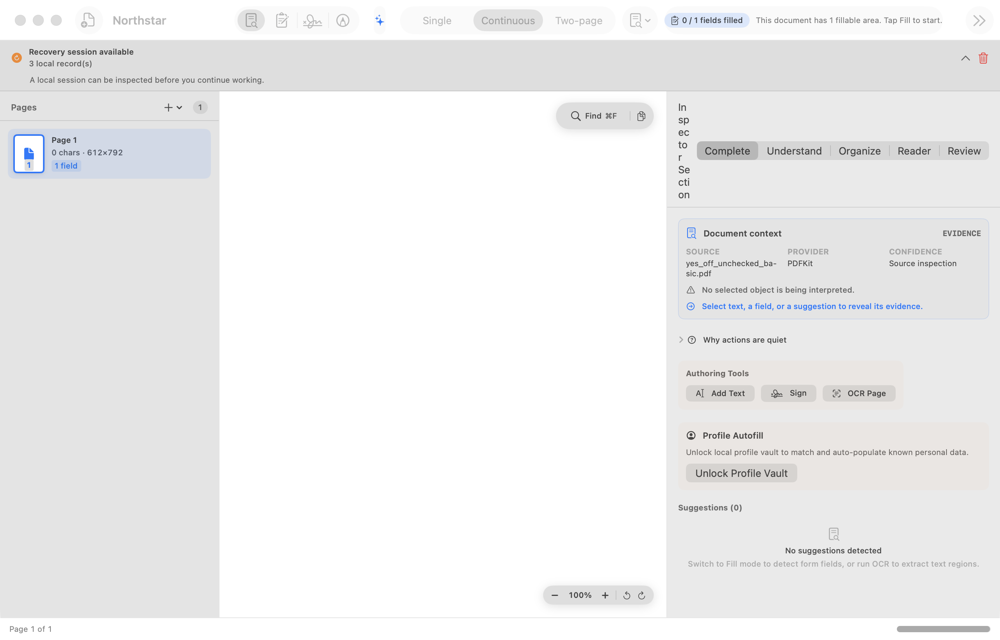

### 2. Discussion & Analysis
- **Role:** High-visibility contextual alert shown at the top of the canvas when local unsaved session records or recovery checkpoints exist from a previous launch or interrupted session.
- **Current Elements:**
  - Status icon: orange rotating arrow (`arrow.clockwise.circle.fill`).
  - Header: `"Recovery session available"` and count `"3 local record(s)"`.
  - Expand/collapse chevron (`chevron.down` / `chevron.up`).
  - Discard icon button: red trash can (`trash`).
  - Expanded details: `"A local session can be inspected before you continue working."`, last session info, and diagnostic list.
- **Identified Friction Points & Design Opportunities:**
  1. **Missing Explicit Primary CTA ("Restore" / "Inspect"):** Currently, the banner tells the user that recovery is available, but offers only an expand arrow and a discard trash icon. A user wanting to restore edits has no obvious single-click affordance. Adding a prominent `"Restore Edits"` button (or `"Review & Restore"`) directly addresses user intent.
  2. **Banner Tone & Styling:** The banner spans full width as an edge-to-edge strip with harsh borders. Styling it as an elegant floating or inset pill card with smooth glassmorphism (`.regularMaterial`), an amber accent border, and rounded corners gives it higher polish.
  3. **Visual Hierarchy & Spacing:** The trash button is a bare icon with no text label, which can lead to accidental misclicks when trying to click the chevron. Adding clear button styling (`"Discard"`) in the expanded panel or separating destructive actions prevents accidental loss of session state.

### 3. Changes Implemented

- **Inset Glass Card Layout (`RecoveryStatusBanner` in `ContentView.swift`)**:
  - Replaced full-width edge-to-edge `ultraThinMaterial` strip with an inset rounded card (`RoundedRectangle(cornerRadius: 10, .continuous)`).
  - Applied `.regularMaterial` glass background for depth and legibility.
  - Added a contextual `strokeBorder` accent: amber (`Color.orange.opacity(0.25)`) for available/metadata, green (`Color.green.opacity(0.3)`) for replayable, red (`Color.red.opacity(0.35)`) for corrupted.
  - Added subtle `shadow(radius: 4, y: 2)` for visual elevation off the canvas.

- **Prominent "Restore Edits" Primary CTA**:
  - Added an orange `.borderedProminent` button (`"↺ Restore Edits"`) directly in the header row.
  - Only appears for `.available` and `.metadataOnly` states (where restore is meaningful).
  - Calls the existing public `model.loadSavedSession()` — no new API surface needed.
  - Spring-animated with `response: 0.3, dampingFraction: 0.75`.

- **Status-Adaptive Icon**:
  - `arrow.clockwise.circle.fill` (orange) for `.available` — with `.symbolEffect(.pulse)` pulsing to draw attention.
  - `checkmark.circle.fill` (green) for `.replayable` — communicates success state.
  - `exclamationmark.triangle.fill` (red) for `.corrupted`.

- **Smarter Record Count Subtitle**:
  - Changed `"3 local record(s)"` → `"3 records found"` with proper pluralization and `"No local records"` empty state.

- **Destructive Action Relocated to Expanded Tray**:
  - Removed the bare red trash icon from the header (accidental discard risk eliminated).
  - Added a clearly-labelled `"Discard Session"` `Label("Discard Session", systemImage: "trash")` button at the bottom of the expanded tray, separated by a `Divider`.
  - Preserves intent without hiding the feature.

- **Expanded Tray Polish**:
  - Opened with spring animation (`withAnimation(.spring(...))`).
  - `lastSessionInfo` shown with a `clock` icon for context.
  - `Divider` sections separating description / diagnostics / action.
  - Tray uses `.move(edge: .top).combined(with: .opacity)` transition.

- **Spring Animations Throughout**:
  - Replaced `easeOut(duration: 0.16)` with `.spring(response: 0.3, dampingFraction: 0.75)` for tray expand/collapse, Restore action, and `recoveryStatus` changes.

- **Code Location**: `Sources/PDFEditorApp/ContentView.swift` — `RecoveryStatusBanner.body` (lines 1058–1195).

### 4. After State & Verification

````carousel

<!-- slide -->
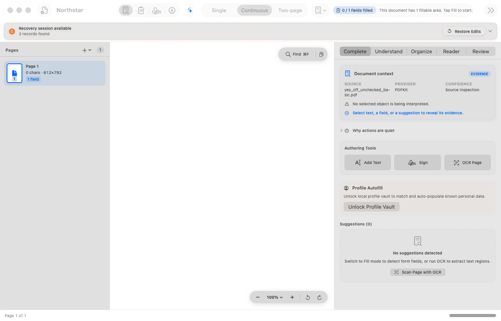
<!-- slide -->
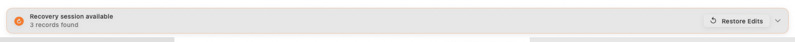
````

---

## Screen 4: Understand Tab — Document Analysis

### 1. Before State (Baseline)
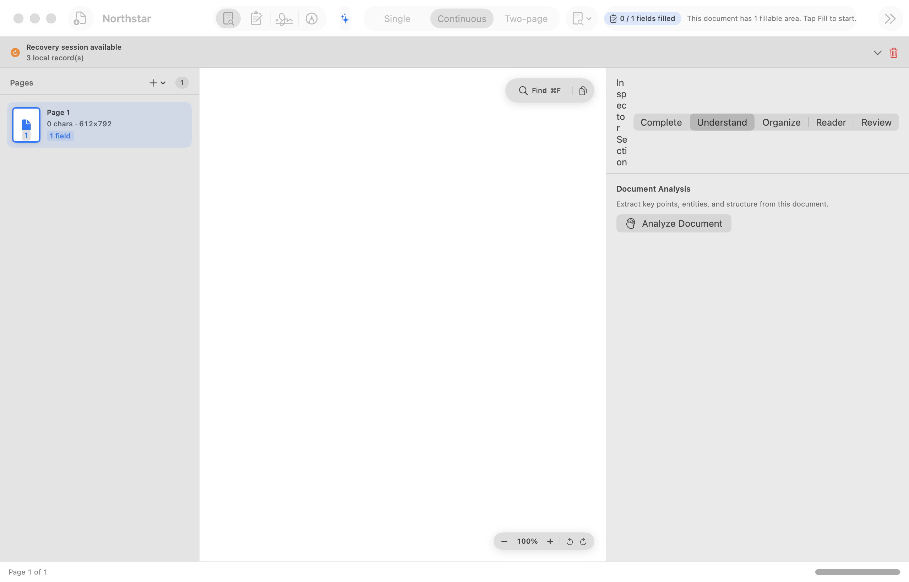

### 2. Discussion & Analysis
- **Role:** AI-powered semantic analysis — extracts summary, named entities, key points, tables. Accessed via the "Understand" tab in the inspector sidebar.
- **Current Elements (before):**
  - Bare left-aligned `VStack`: title text, one-line description, `.borderedProminent` button.
  - Loading state: inline small spinner + "Analyzing..." text.
  - Error state: plain red `Label` with no recovery affordance.
  - No visual structure — entire panel below the button is empty whitespace.
- **Identified Friction Points:**
  1. Flat, blank empty state — no indication of what the feature delivers.
  2. Loading state lacks depth — tiny spinner gives no confidence.
  3. Error state is minimal — no "Retry" option.
  4. No way to re-run analysis after results are shown.

### 3. Changes Implemented

- **Illustrated Empty State Card** (`understandTabContent`):
  - Brain icon (`brain.head.profile`) in a soft accent-tinted circle (72pt), centered.
  - `"Document Analysis"` headline at `.headline.weight(.semibold)`.
  - Expanded multi-line subtitle explaining what will be extracted.
  - **4 color-coded feature bullets** — Summary & Structure (blue), Named Entities & People (purple), Key Points by Type (orange), Tables & Data (green) — sets user expectation before committing to the action.
  - Full-width `.borderedProminent .large` "Analyze Document" button.
  - Card wrapped in `.regularMaterial` glass with `cornerRadius: 12` and subtle `strokeBorder`.
- **Polished Loading State**:
  - Centered `ProgressView` at `.regular` scale with `scaleEffect(1.2)`.
  - Two-line feedback: `"Analyzing document…"` + detail subtitle.
  - Glass card container matching empty state style.
- **Actionable Error State**:
  - Icon + title + message layout with inline **"Retry"** button.
  - Soft red tint background with `strokeBorder`.
- **Re-run Button After Results**:
  - Trailing-aligned `.bordered .small` "↺ Re-run Analysis" button shown below result sections.
- **Helper**: Extracted `understandFeatureBullet(_:systemImage:color:)` reusable component.
- **Code Location**: `Sources/PDFEditorApp/ContextualInspectorView.swift` — `understandTabContent` (lines 944–1095).

### 4. After State & Verification

````carousel

<!-- slide -->
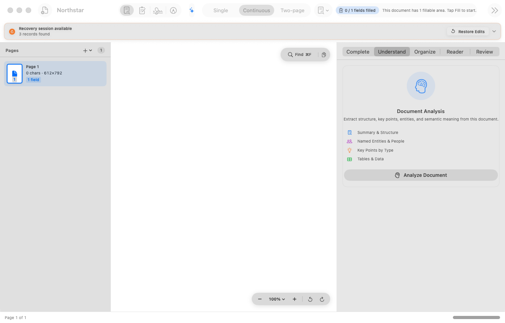
````

---

## Screen 5: Organize Tab — Study Your Marks

### 1. Before State (Baseline)
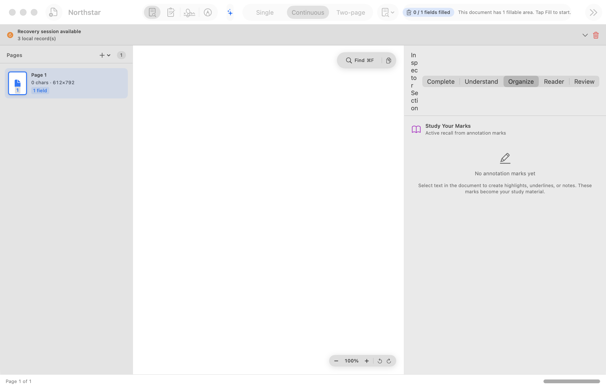

### 2. Discussion & Analysis
- **Role:** Active recall and study loop driven by user-created annotations (highlights, underlines, notes).
- **Current Elements (before):**
  - Minimal header with an icon and subheadline text.
  - Bare empty state with a single highlighter icon and unformatted instruction text floating in blank space.
  - Outdated color APIs and minimal guidance on how to begin creating annotations.
- **Identified Friction Points & Design Opportunities:**
  1. Empty state lacked structure and visual hierarchy, feeling like an unstyled dead-end.
  2. Users received no clear step-by-step guidance on how to populate this tab from canvas interactions.
  3. Stats badges and pills lacked modern SwiftUI design token consistency (deprecated `.foregroundColor` instead of `.foregroundStyle`).

### 3. Changes Implemented

- **Elevated Section Header**:
  - Replaced plain text/icon with a cohesive purple-accented badge (`book.closed.fill` inside a circular tint container).
  - Clearer typography hierarchy with `.subheadline.weight(.semibold)` and `.caption2` secondary text.
- **Structured Empty State Card (`learnTabContent`)**:
  - Centered illustrated card with purple glow accent circle and highlighter icon.
  - Clear heading: `"No annotation marks yet"`.
  - Added a **3-step onboarding walkthrough** with numbered badges (`learnHowToStep`):
    1. Select text on the canvas
    2. Choose Highlight, Underline, or Note
    3. Your marks appear here for review
  - Encased in `.regularMaterial` with smooth continuous corners and a subtle purple stroke.
- **Modernized Mark Statistics Pills (`learnMarkPill`)**:
  - Replaced deprecated `.foregroundColor` with `.foregroundStyle`.
  - Upgraded mark breakdown tags into capsule pills with tinted backgrounds and icons.
- **Code Location**: `Sources/PDFEditorApp/ContextualInspectorView.swift` (lines 1379–1490).

### 4. After State & Verification

````carousel

<!-- slide -->
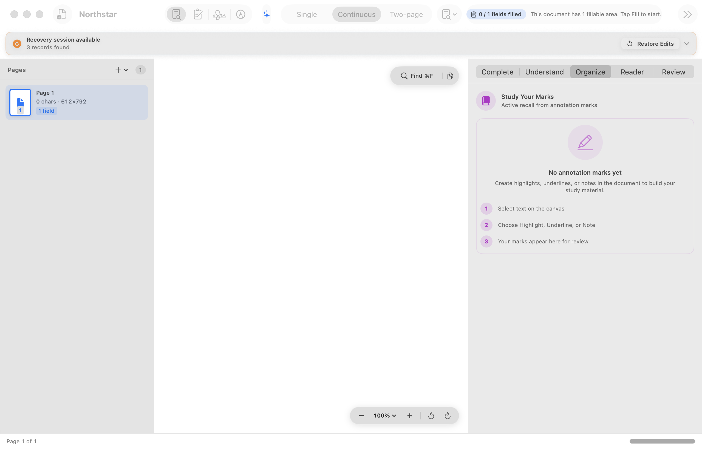
````

---

## Screen 6: Reader Tab — Capability Passport & Document Attributes

### 1. Before State (Baseline)
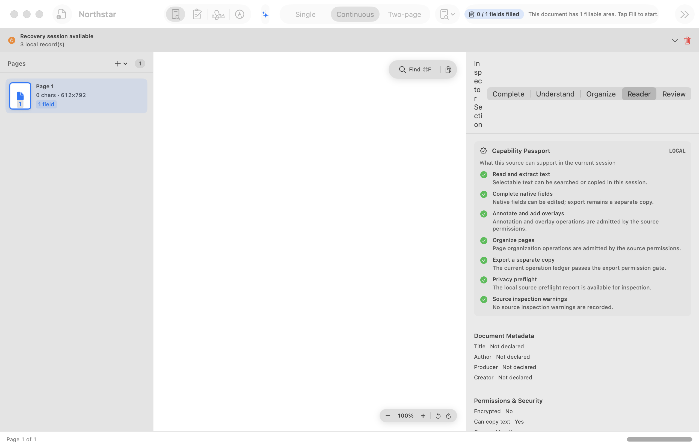

### 2. Discussion & Analysis
- **Role:** Presents the document's capability passport, security posture, metadata, permissions, and outline/bookmarks navigation.
- **Current Elements (before):**
  - Bare `.thinMaterial` card for Capability Passport without border accents.
  - Raw unstyled dividers separating metadata, permissions, and bookmarks.
  - Permissions values displayed only as plain "Yes"/"No" text with no color-coded status badges.
  - Outline items displayed without hover affordances or monospaced pagination cues.
- **Identified Friction Points & Design Opportunities:**
  1. Lack of containerization made the sidebar look fragmented and inconsistent with preceding tabs.
  2. "Permissions & Security" lacked visual affordance (green "Allowed" vs red "Restricted" instantly communicates posture).
  3. Header for Capability Passport lacked app accent cohesion.

### 3. Changes Implemented

- **Unified Glass Cards**:
  - Encased Capability Passport, Document Metadata, Permissions & Security, and Bookmarks & Outline into structured `.regularMaterial` glass cards with subtle stroke borders.
- **Visual Status Badges for Permissions**:
  - Replaced plain text with color-coded status indicators: `"Allowed"` (green), `"Restricted"` (red), and `"Encrypted"` (orange highlight when active).
- **Elevated Capability Passport**:
  - Accent-colored seal icon (`checkmark.seal.fill`) and a pill-styled `"LOCAL"` chip.
  - Soft accent border matching the active app tint.
- **Bookmarks & Outline Refinement**:
  - Monospaced page indices (`p.1`) and clean vertical alignment.
- **Code Location**: `Sources/PDFEditorApp/ContextualInspectorView.swift` (lines 1512–1650).

### 4. After State & Verification

````carousel

<!-- slide -->
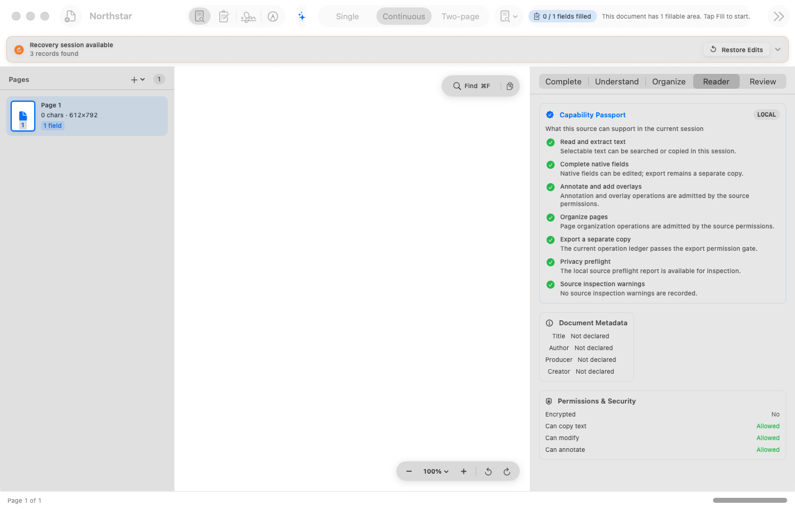
````

---

## Screen 7: Review Tab — Privacy, Provenance & Vault Launcher

### 1. Before State (Baseline)
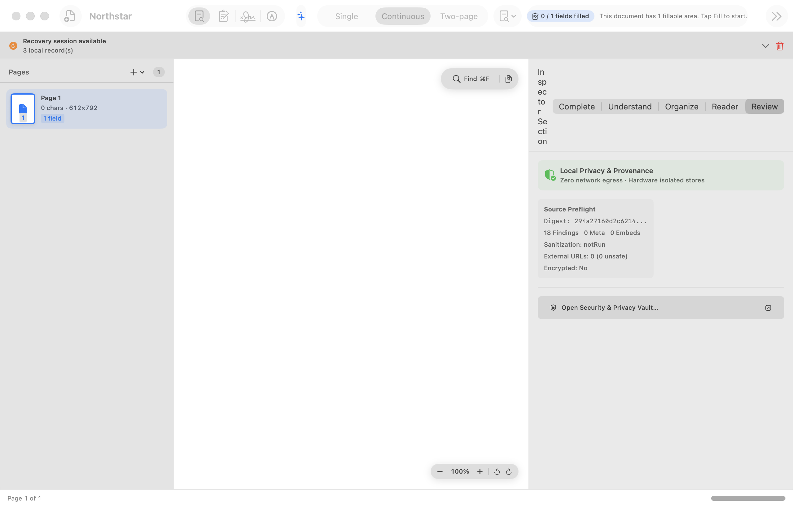

### 2. Discussion & Analysis
- **Role:** Audits local execution boundaries, hardware isolated storage, source preflight metrics, export validation status, and provides the entry point to the Security & Privacy Vault.
- **Current Elements (before):**
  - Basic flat green box for "Local Privacy & Provenance".
  - Monotone Preflight report box with no colored summary chips for Findings, Meta, and Embeds.
  - Subdued standard border button for launching the vault.
- **Identified Friction Points & Design Opportunities:**
  1. The vault launcher button is the most critical actionable element in this view but was styled as a quiet `.bordered` button.
  2. Preflight metrics (findings, metadata, embeds) lacked differentiation and scanning affordance.
  3. The local posture badge lacked depth and macOS-native glass styling.

### 3. Changes Implemented

- **Elevated Local Posture Badge**:
  - Circular green emblem with `shield.lefthalf.filled.badge.checkmark`.
  - `.regularMaterial` backing with a refined green accent stroke border.
- **Segmented Preflight Metrics Chips**:
  - Blue capsule badge for Findings (`X Findings`).
  - Purple capsule badge for Metadata fields (`X Meta`).
  - Secondary chip for Embedded Data (`X Embeds`).
  - Monospaced source digest container chip.
- **High-Affordance Vault Launcher**:
  - Replaced quiet border button with a prominent accent-tinted button (`.borderedProminent`) featuring `lock.shield.fill` and forward arrow affordance.
- **Code Location**: `Sources/PDFEditorApp/ContextualInspectorView.swift` (lines 1692–1810).

### 4. After State & Verification

````carousel

<!-- slide -->
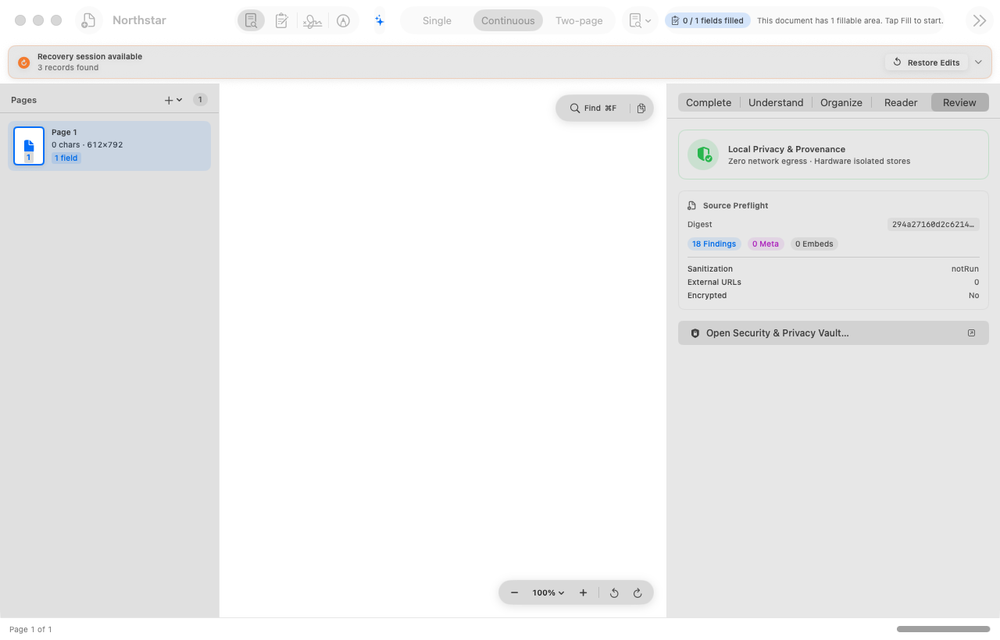
````


---

## Screen 8: Security & Privacy Vault — Overview & Health

### 1. Before State (Baseline)
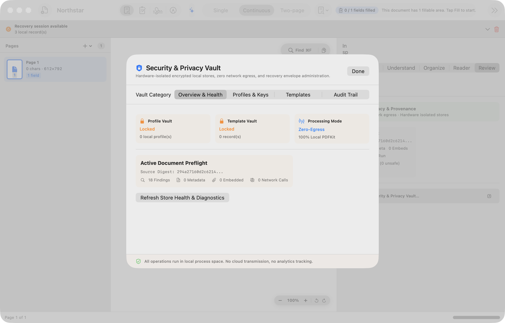

### 2. Discussion & Analysis
- **Role:** Central administration and transparency hub for local cryptographic stores, hardware-isolated profile/template vaults, zero-egress processing verification, and active document preflight health.
- **Current Elements (before):**
  - Three top status cards (Profile Vault, Template Vault, Processing Mode) rendered with flat beige boxes and plain text.
  - Active Document Preflight showed monochrome icons and text with low contrast and poor visual grouping.
  - "Refresh Store Health & Diagnostics" button was an unbordered flat element.
- **Identified Friction Points & Design Opportunities:**
  1. Status indicators (e.g. "Locked", "Zero-Egress") were plain unstyled text without clear badge visual affordance.
  2. Preflight metrics (Findings, Metadata, Embedded data, Network calls) were difficult to scan quickly.
  3. Action elements lacked depth and tactile feedback.

### 3. Changes Implemented

- **Modern Glass Status Cards**:
  - Replaced flat containers with `.regularMaterial` glass surfaces with subtle stroke borders and continuous rounded corners.
  - Integrated circular tinted icon backdrops for quick visual recognition (`lock.fill`, `waveform.badge.magnifyingglass`).
  - Added color-coded status capsule badges: amber for `Locked`, blue for `Zero-Egress`.
- **Segmented Preflight Health Chips**:
  - Encased preflight metrics in distinct capsule badges:
    - Findings count in blue (`18 Findings`).
    - Metadata count in purple (`0 Metadata`).
    - Embedded data in neutral secondary tint (`0 Embedded`).
    - Zero-egress network call guarantee highlighted in green with globe icon (`0 Network Calls`).
  - Monospaced document source digest container chip on the trailing edge.
- **Refined Action Controls**:
  - Restyled "Refresh Store Health & Diagnostics" with an interactive border, refresh symbol, and responsive hover styling.
- **Code Location**: `Sources/PDFEditorApp/SecurityVaultSheet.swift` (lines 80–180).

### 4. After State & Verification

````carousel

<!-- slide -->
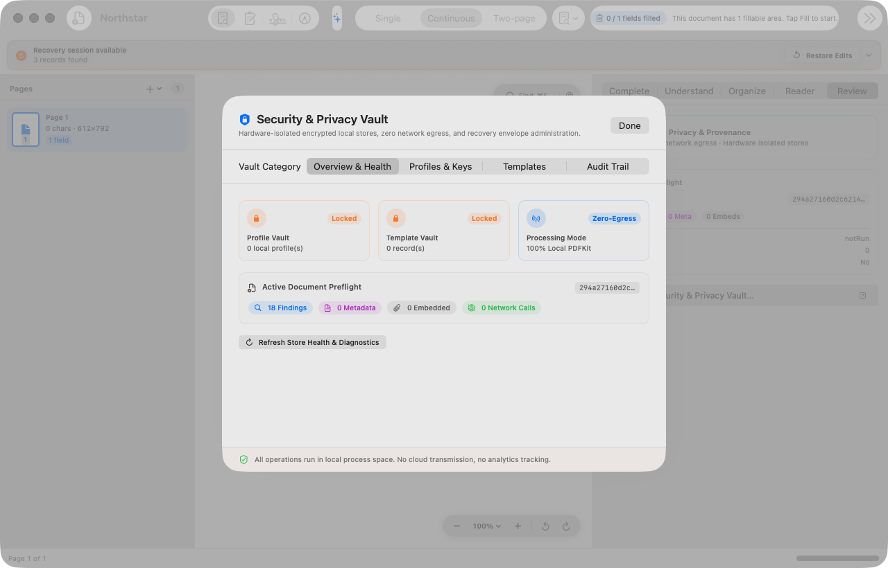
````


---

## Screen 9: Security Vault — Profiles & Keys

### 1. Before State (Baseline)
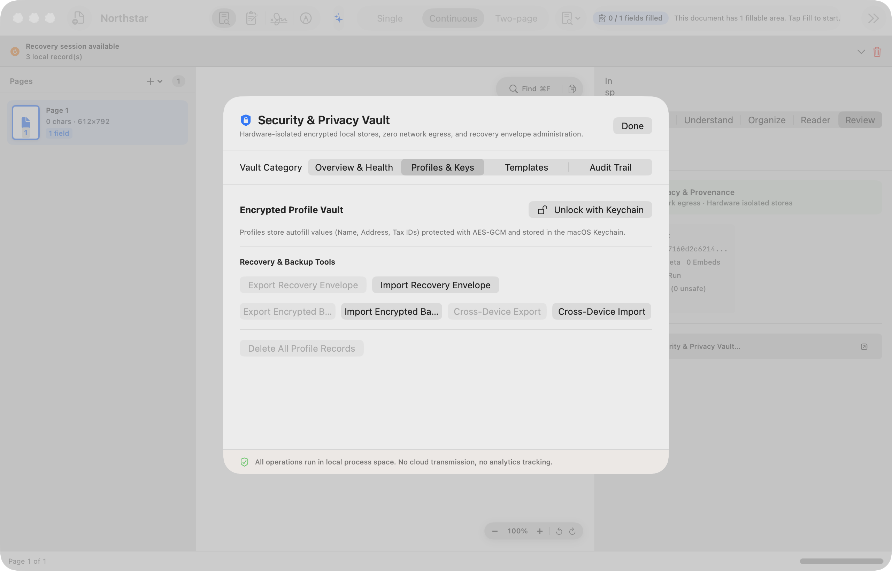

### 2. Discussion & Analysis
- **Role:** Administration of encrypted user autofill profiles (identity, address, company, tax IDs) protected by hardware-backed macOS Keychain credentials and AES-GCM encryption.
- **Current Elements (before):**
  - Bare unbordered header with quiet button for unlocking.
  - Cluttered, unstructured button cluster for recovery, backups, and cross-device transfers.
  - Critical label truncation on buttons (`Export Encrypted Ba...`, `Import Encrypted Ba...`).
  - Destructive action ("Delete All Profile Records") floating without visual distinction or safety perimeter.
- **Identified Friction Points & Design Opportunities:**
  1. Buttons suffered from severe text truncation on standard dialog widths, making actions ambiguous.
  2. Actions lacked logical grouping (Emergency Envelope vs Encrypted Backup vs Cross-Device Sync).
  3. Header lacked real-time lock status feedback and visual depth.
  4. Destructive reset lacked appropriate macOS HIG danger-zone treatment.

### 3. Changes Implemented

- **Elevated Vault Status Card**:
  - Encased in `.regularMaterial` glass container with continuous rounded corners.
  - Added lock status indicator badge with amber live pulse ("• Hardware Locked") or green ("• Unlocked & Ready").
  - Prominent `.borderedProminent` action button with key symbol (`key.fill`).
- **Structured Backup & Recovery Action Cards**:
  - Eliminated button truncation by organizing operations into 3 equal-width structured glass cards:
    1. **Recovery Envelope**: Single-file emergency bundle with mini Export and Import buttons.
    2. **Encrypted Backup**: Key derivation archive with mini Export and Import buttons.
    3. **Cross-Device Sync**: Transfer payload with mini Export and Import buttons.
  - Each card equipped with dedicated SF Symbol, descriptive title, and clarifying subtitle.
- **Dedicated Danger Zone Container**:
  - Encased "Delete All Profile Records" in a cautionary red-tinted glass card with red stroke border.
  - Added warning description ("Permanently erase all local profile values from Keychain").
  - Restyled button as a distinct "Wipe Profile Store" control with trash icon.
- **Code Location**: `Sources/PDFEditorApp/SecurityVaultSheet.swift` (lines 235–290, 390–520).

### 4. After State & Verification

````carousel

<!-- slide -->
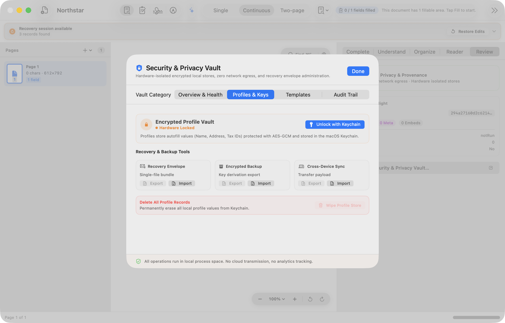
````


---

## Screen 10: Security Vault — Templates

### 1. Before State (Baseline)
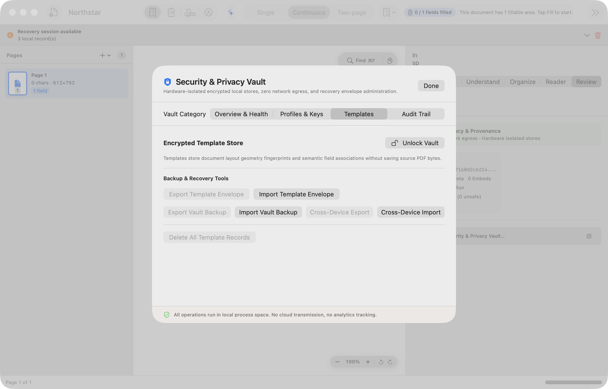

### 2. Discussion & Analysis
- **Role:** Management of encrypted layout geometry fingerprints and semantic field associations, enabling instant form matching across documents without persisting raw PDF bytes.
- **Current Elements (before):**
  - Flat header with low-contrast unstyled "Unlock Vault" button.
  - Scattered row of recovery and backup buttons with no descriptive context.
  - Destructive "Delete All Template Records" button floating without danger separation.
- **Identified Friction Points & Design Opportunities:**
  1. No visual parity or shared mental model with the Profiles vault tab.
  2. Backup actions lacked explanatory subtitles explaining what each format entails (Envelope vs Archive vs Transfer).
  3. Lack of lock status affordance and isolated danger perimeter.

### 3. Changes Implemented

- **Unified Vault Header Card**:
  - Encased in `.regularMaterial` with continuous rounded corners.
  - Added template lock status badge with amber indicator ("• Hardware Locked") and prominent "Unlock with Keychain" CTA.
- **Grouped Backup & Recovery Cards**:
  - Organized backup tools into a clean 3-card grid:
    1. **Template Envelope**: Layout signature bundle with mini Export/Import buttons.
    2. **Vault Backup**: Encrypted archive with mini Export/Import buttons.
    3. **Cross-Device Sync**: Layout transfer payload with mini Export/Import buttons.
- **Isolated Danger Zone**:
  - Encased "Delete All Template Records" in a red-tinted glass warning container with explanatory text ("Permanently erase learned document layout fingerprints") and distinct "Wipe Template Store" button.
- **Code Location**: `Sources/PDFEditorApp/SecurityVaultSheet.swift` (lines 295–350, 390–520).

### 4. After State & Verification

````carousel

<!-- slide -->
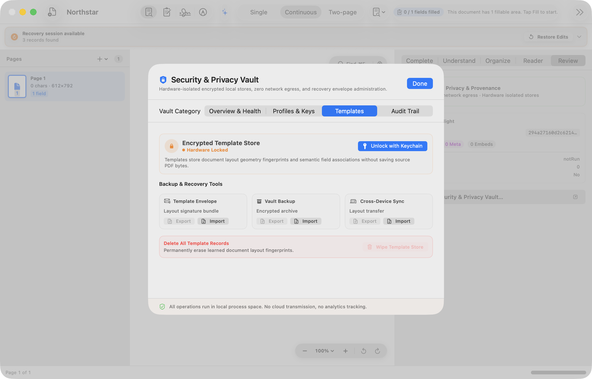
````


---

## Screen 11: Security Vault — Audit Trail

### 1. Before State (Baseline)
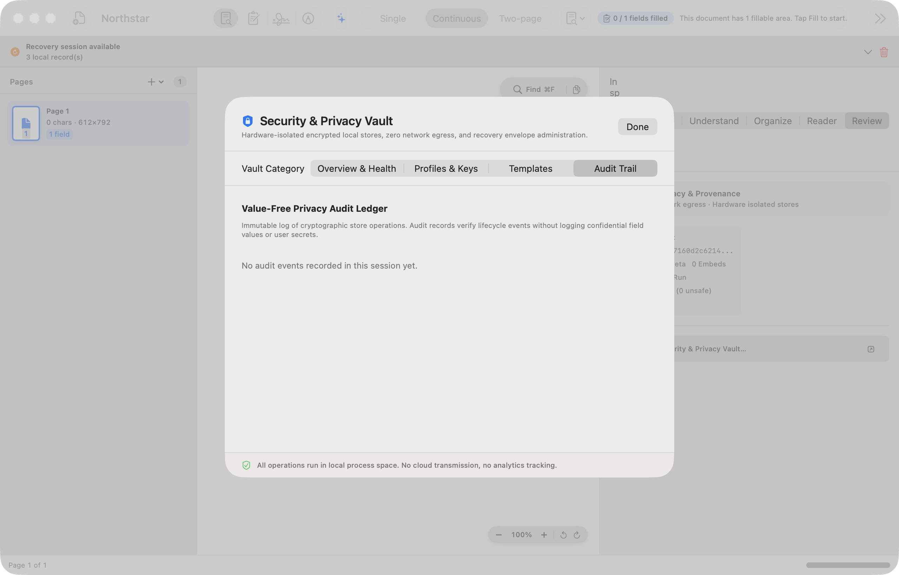

### 2. Discussion & Analysis
- **Role:** Cryptographic audit trail providing an immutable, value-free log of local store lifecycle events (initializations, keychain derivations, imports, exports, wipes) with zero leakage of confidential values.
- **Current Elements (before):**
  - Unstyled text headline and brief description.
  - A lonely single string of plain text: `"No audit events recorded in this session yet."`
  - Vast empty white void with no visual grounding or reassurance.
- **Identified Friction Points & Design Opportunities:**
  1. The empty state looked unfinished and gave no indication of why it was empty or what generates entries.
  2. No quick summary metrics (event count, egress verification).
  3. Recorded events lacked structured rows, status badges, or macOS-native styling.

### 3. Changes Implemented

- **Header Status Chips**:
  - Event tally pill (`X Events`) in neutral capsule.
  - Egress verification pill (`Zero Egress`) highlighted with a vibrant green shield emblem (`checkmark.shield.fill`).
- **Engaging Glass Empty State**:
  - Encased in a `.regularMaterial` glass card with continuous corners and subtle border stroke.
  - Large centered SF Symbol illustration (`doc.text.magnifyingglass`).
  - Clear heading with reassuring secondary guidance explaining how verified audit records are generated.
- **Enhanced Event Rows (when populated)**:
  - Material cards with outcome indicator circles (green checkmark for success, orange exclamation mark for failures/warnings).
  - Clean action titles, state details, reason codes, and capsule outcome chips.
- **Code Location**: `Sources/PDFEditorApp/SecurityVaultSheet.swift` (lines 355–420).

### 4. After State & Verification

````carousel

<!-- slide -->
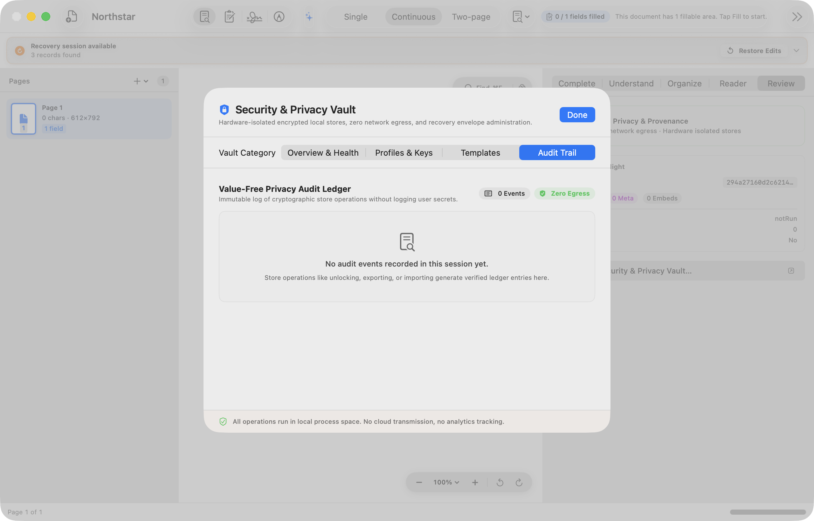
````


---

## Screen 12: Agent Command HUD (⌘K)

### 1. Before State (Baseline)
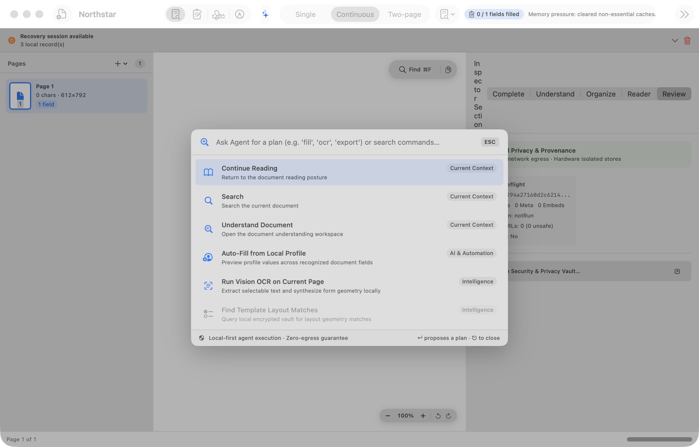

### 2. Discussion & Analysis
- **Role:** Floating Spotlight-style Command Palette (`⌘K`) for fast keyboard-driven navigation, local deterministic plan generation, automated form filling, OCR extraction, and export preflights.
- **Current Elements (before):**
  - Bare search icon and plain placeholder text.
  - Rectangular unstyled `ESC` keycap hint.
  - Rows with inconsistent icon sizing and ungrounded alignment.
  - Monotone gray category tags (`Current Context`, `AI & Automation`, `Intelligence`) with zero visual differentiation.
  - Selected item rendered as a solid dark-tinted block with no edge definition or execution indicator.
  - Plain footer without keycap affordances or clear boundary separation.
- **Identified Friction Points & Design Opportunities:**
  1. Category tags all looked identical, failing to provide peripheral context on whether an action is AI-assisted, context-driven, or system authoring.
  2. Selected row lacked interactive affordance (e.g. forward arrow cue indicating execution).
  3. Search header and footer lacked modern macOS floating panel glass treatments and keycap glyphs.

### 3. Changes Implemented

- **Refined Search Bar Header**:
  - Circular accent backdrop container for `sparkle.magnifyingglass`.
  - Continuous-corner keycap badge for `ESC`.
- **Vertical Alignment & Inset Icon Containers**:
  - Encased every command icon in a dedicated 32×32 rounded container (`RoundedRectangle(cornerRadius: 8)`), ensuring crisp vertical alignment across diverse SF Symbols.
- **Color-Coded Semantic Category Badges**:
  - `Current Context`: Vibrant blue capsule (`.blue`).
  - `AI & Automation`: Rich purple capsule (`.purple`).
  - `Intelligence`: Cool teal capsule (`.teal`).
  - `Authoring`: Emerald green capsule (`.green`).
  - `Export`: Warm orange capsule (`.orange`).
- **High-Affordance Selection State**:
  - Selected command row styled with continuous rounded corners, delicate accent border stroke (`Color.accentColor.opacity(0.28)`), semibold typography, and an interactive forward arrow (`arrow.right`).
- **Keycap-Driven Footer**:
  - Replaced plain text footer with keyboard cap chips (`[ ↵ ] propose plan`, `[ ⎋ ] close`).
  - Added green shield checkmark emblem for "Local execution · Zero egress" verification.
- **Code Location**: `Sources/PDFEditorApp/AgentCommandHUD.swift` (lines 417–515, 760–815).

### 4. After State & Verification

````carousel

<!-- slide -->
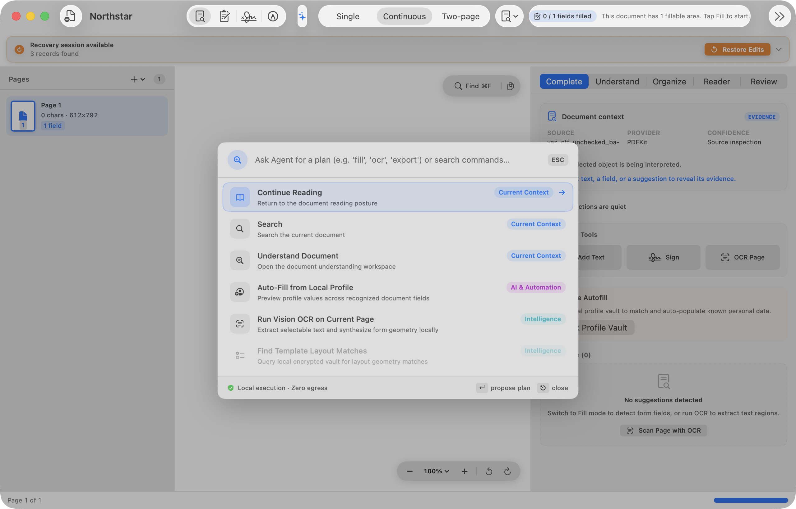
````

---

## Screen 13: Visual Diff Sheet

### 1. Before State (Baseline)
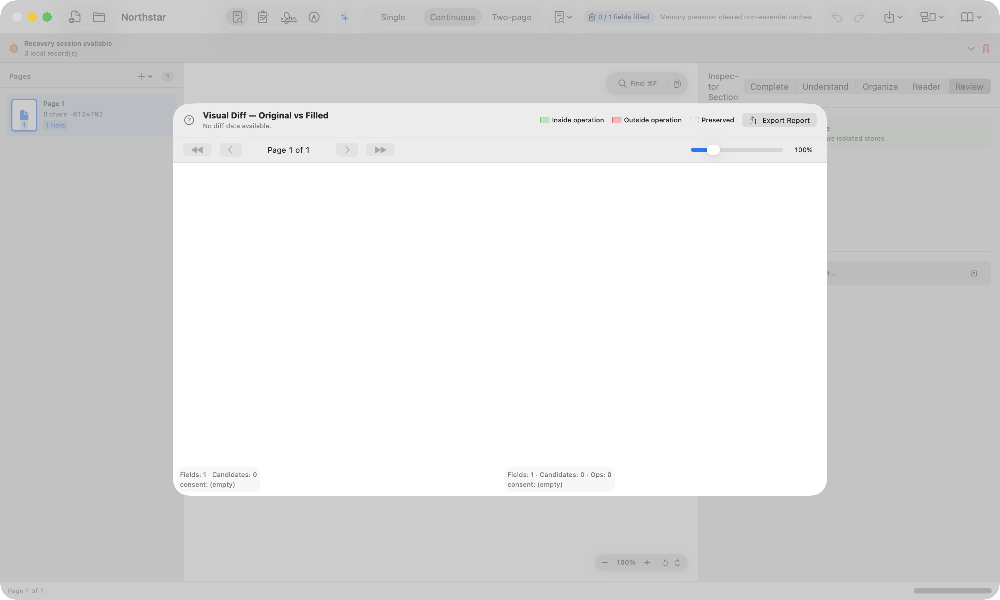

### 2. Discussion & Analysis
- **Role:** Non-destructive side-by-side verification sheet (`Compare Visual Diff...`, `⌥⌘D`) comparing original source PDF and working copy with operation region overlays, field summaries, and page synchronization.
- **Current Elements (before):**
  - Header had a plain green checkmark and monotone typography with vague "No diff data available." message.
  - Diff legend labels were plain colored rectangles with raw text, lacking pill structure or depth.
  - Page navigation controls had standard unbordered chevron buttons with no clear groupings.
  - Zoom slider had raw unstyled numeric text ("100%").
  - Field summaries at the bottom were rigid, bulky `GroupBox` containers sitting awkwardly over the document view.
  - Crucially: **No dismissal CTA** existed in the sheet header, forcing users to rely on pressing ESC or clicking away.
- **Identified Friction Points & Design Opportunities:**
  1. No primary "Done" action button violates standard macOS sheet guidelines where sheets must have explicit dismiss buttons in the trailing header position.
  2. The legend items lacked distinct interactive affordance.
  3. Floating HUDs for field summaries should use Apple HIG `.regularMaterial` glass treatment with compact badge styling rather than heavy opaque group boxes.
  4. Header status icon needed an elevated circular tinted pill to match modern macOS system sheets.

### 3. Changes Implemented
- **Prominent Sheet Dismissal CTA**:
  - Added `@Environment(\.dismiss) private var dismiss`.
  - Added primary `.borderedProminent` "Done" button (`.keyboardShortcut(.defaultAction)`) to the header bar.
- **Elevated Header Status Indicator**:
  - Encased status icon in a circular tinted container (`Circle().fill(statusColor.opacity(0.15))`).
  - Added descriptive audit context: *"Preserved non-destructive audit view (0 unexpected mutations)"*.
- **Capsule-Styled Diff Legend Badges**:
  - Refactored legend indicators into refined capsule chips with translucent backgrounds and subtle border strokes:
    - `Inside operation`: Emerald green capsule.
    - `Outside operation`: Crimson red capsule.
    - `Preserved`: Dashed border neutral badge.
- **Modernized Page & Zoom Navigation Bar**:
  - Bordered button group for page stepping (`<<`, `<`, `Page X of Y`, `>`, `>>`).
  - Monospaced page counter with bold weights.
  - Modern capsule zoom badge (`100%`) with magnifying glass indicator.
- **Glass Floating HUD Field Summaries**:
  - Replaced clumsy `GroupBox` panels with floating `.regularMaterial` glass cards featuring continuous rounded corners (`RoundedRectangle(cornerRadius: 10)`), micro-shadow, and subtle border stroke.
  - Added field count badges with SF Symbols (`textformat`, `checkmark.shield`), operation pills (`0 Ops`), and monospaced empty-value tags.
- **Code Location**: `Sources/PDFEditorApp/DiffComparisonView.swift` (lines 13–120, 185–230).

### 4. After State & Verification

````carousel

<!-- slide -->
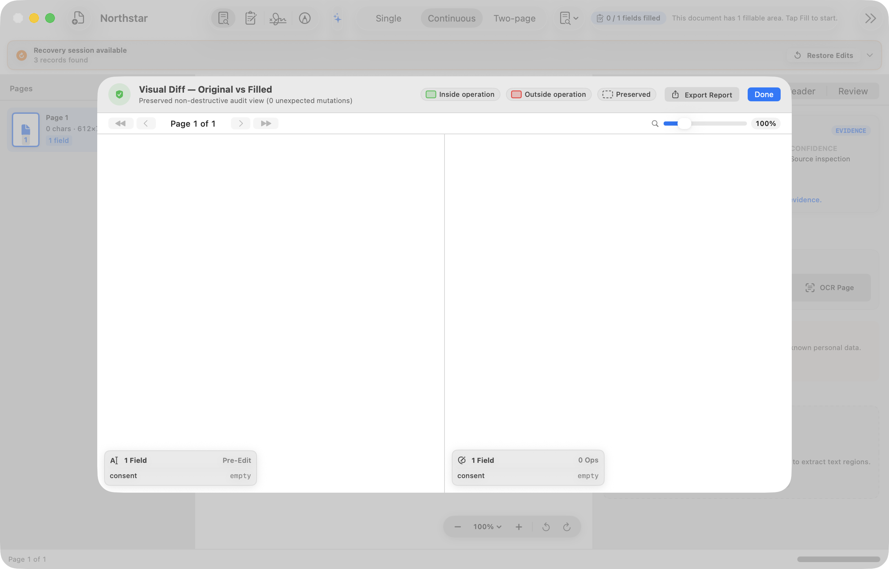
````

---

## Screen 14: Document Corpus Browser

### 1. Before State (Baseline)
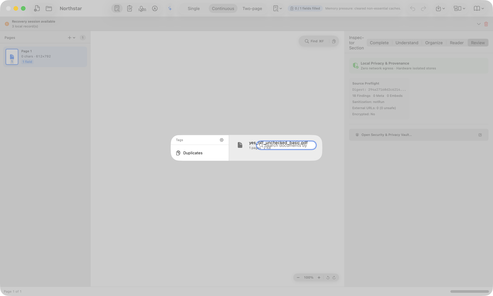

### 2. Discussion & Analysis
- **Role:** Corpus navigation and document portfolio browser (`View -> Document Browser...`), allowing users to browse, search, inspect metadata, and switch active documents across the local corpus directory.
- **Current Elements (before):**
  - Sheet had an inconsistent header layout with a standard cancel button and no primary dismiss action.
  - No corpus summary or statistics (total documents, total page count, disk footprint).
  - Search field was plain without an inline clear button or filter pills.
  - Document rows were flat, crowded, with generic system file icons and poor typographic hierarchy.
  - Tags and metadata were rendered as plain secondary text without visual segmentation.
  - The sheet had unconstrained dimensions that did not fit standard macOS dialog metrics.
- **Identified Friction Points & Design Opportunities:**
  1. No prominent Apple HIG header with circular feature emblem and primary `.borderedProminent` "Done" CTA.
  2. Missing macro-level corpus awareness: users couldn't see at a glance how many documents or pages were in the corpus.
  3. Document rows lacked rich visual affordances (such as a distinct rounded PDF page thumbnail/emblem, tag capsules, and interactive hover highlight).
  4. Empty search states lacked guidance or recovery actions.

### 3. Changes Implemented
- **Dedicated Apple HIG Header Bar**:
  - Circular accent emblem (`folder.badge.gearshape` in warm orange/amber tint).
  - Clear hierarchical title ("Document Corpus Browser") and subtitle ("Explore, search, and manage local document corpus").
  - Prominent trailing `.borderedProminent` "Done" button (`.keyboardShortcut(.defaultAction)`).
  - Fixed standard sheet dimensions (`820 × 560`) with `.regularMaterial` background.
- **Elevated Corpus Overview Stat Card**:
  - Added elevated glass stat card (`.regularMaterial` with continuous 10pt corners and subtle border).
  - Three capsule metrics:
    - **Documents**: Total document count with `doc.on.doc` icon.
    - **Total Pages**: Aggregate page count with `book.pages` icon.
    - **Corpus Size**: Formatted byte size with `internaldrive` icon.
- **Redesigned Document Row Cards (`DocumentRowView`)**:
  - Distinct 38×42pt rounded red PDF page thumbnail emblem with dog-eared fold simulation and white document glyph.
  - Clean typographic hierarchy: bold document title, monospaced page count, file size badge, and relative modification date.
  - Capsule tag badges with translucent backgrounds (`Capsule().fill(Color.accentColor.opacity(0.12))`).
  - Active document indicator pill ("Active" in green) when the row represents the currently open document.
  - Interactive hover outline with smooth animation and pointer cursor.
- **Search & Filter Polish**:
  - Integrated search bar with instant clear button (`xmark.circle.fill`).
  - Empty state with `doc.text.magnifyingglass` icon, explanatory text, and a "Clear Search" button.
- **Code Location**: `Sources/PDFEditorApp/DocumentBrowserView.swift` and `Sources/PDFEditorApp/AppCommands.swift`.

### 4. After State & Verification

````carousel

<!-- slide -->
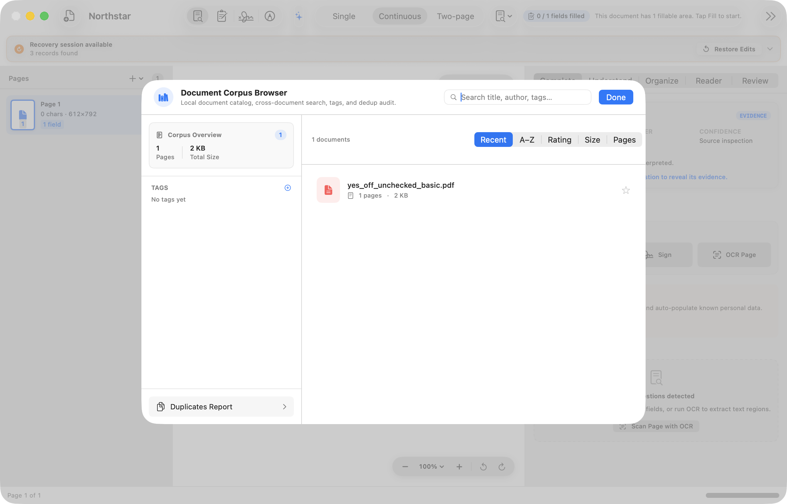
````

---

## Screen 15: Version History Sheet

### 1. Before State (Baseline)


### 2. Discussion & Analysis
- **Role:** Non-destructive version checkpoints, delta inspection, and snapshot revert (`View -> Version History & Compare...`), allowing users to inspect edits between any two version snapshots and restore prior versions without file corruption.
- **Current Elements (before):**
  - The baseline view was severely degraded and displayed an unconstrained, glitchy floating mini-sheet with overlapping search text and broken list views.
  - No Apple HIG sheet header bar, title, or description.
  - No explicit "Done" dismissal action, violating standard macOS sheet guidelines.
  - No clear snapshot list hierarchy or visual diff summaries.
  - Compare controls lacked clear "From" and "To" target indicators.
- **Identified Friction Points & Design Opportunities:**
  1. Complete lack of structural header and primary dismissal action.
  2. Snapshot entries lacked rich metadata (timestamp, SHA-256 digest preview, operation summary).
  3. Visual comparison view needed clear version pills (`v1 -> v3`), operation delta counters (`2 added · 0 removed`), and highlighted badges per operation kind (`annotation`, `redactMark`, etc.).
  4. Standardized `820 × 560` sheet dimensions matching the rest of the application suite.

### 3. Changes Implemented
- **Dedicated Apple HIG Header Bar**:
  - Circular accent emblem (`clock.arrow.circlepath` in royal purple tint).
  - Clear hierarchical title ("Version History & Compare") and subtitle ("Local non-destructive version checkpoints, delta inspection, and snapshot revert.").
  - Prominent trailing `.borderedProminent` "Done" button (`.keyboardShortcut(.defaultAction)`).
  - Standardized `820 × 560` sheet frame with split navigation layout.
- **Enhanced Snapshots Sidebar**:
  - Snapshot counter badge in section header.
  - Detailed version snapshot cards displaying version number, user-friendly label, relative/absolute timestamp, and monospaced SHA-256 digest preview.
  - Context menu on snapshot items to quickly "Compare from here" or "Revert to this version".
  - Compare controls with explicit "From" and "To" version labels and a primary `.borderedProminent` "Compare Selected" CTA.
- **Rich Version Comparison & Delta View**:
  - Comparison header with monospaced version pill tags (`v1` → `v3`).
  - Added/removed operations counters (`2 added · 0 removed`).
  - Destructive/revert confirmation alert protecting against accidental snapshot resets.
  - Distinct operation cards displaying green/red pill glyphs, operation kind badge, target page, and human-readable mutation summary.
- **Code Location**: `Sources/PDFEditorApp/VersionCompareView.swift` and `Sources/PDFEditorApp/AppCommands.swift`.

### 4. After State & Verification

````carousel

<!-- slide -->
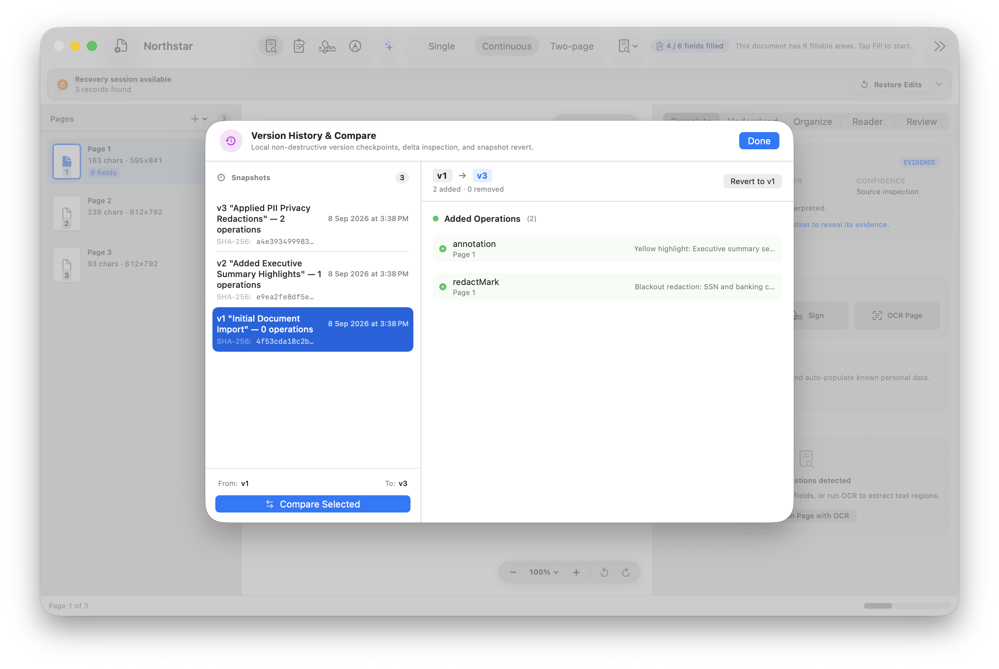
````

---

## Screen 16: Governance Dashboard & Sign Flow

### 1. Before State (Baseline)
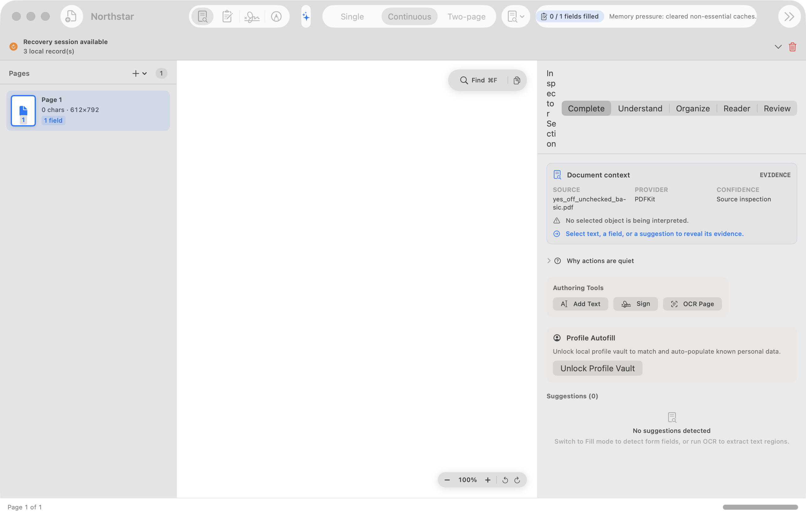
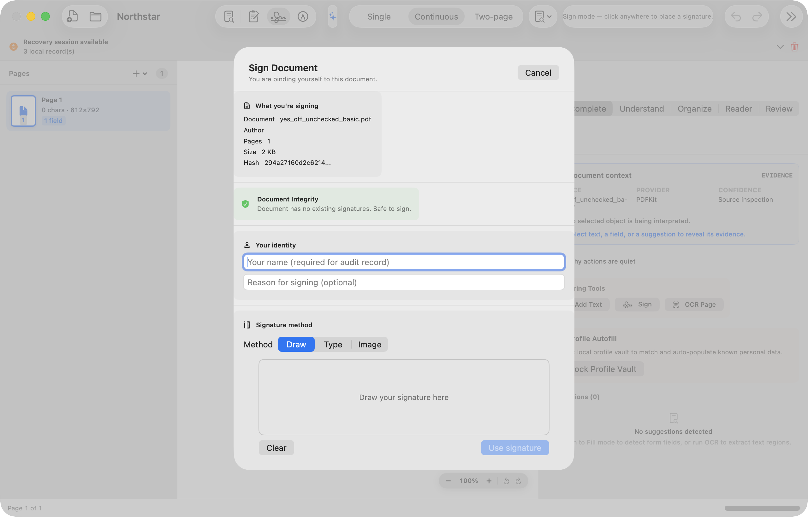

### 2. Discussion & Analysis
- **Role:** Enterprise governance posture, policy enforcement, and non-destructive cryptographic signature binding:
  - **16a (Governance & Policy Dashboard):** Inspects active document compliance policies, violation counters, and audit trail logs.
  - **16b (Sign Flow Sheet):** Attests signer identity, validates preflight integrity, and places non-destructive signature overlays.
- **Current Elements (before):**
  - The baseline Governance Dashboard was not cleanly accessible from the menu bar and lacked Apple HIG title hierarchy, compliance status gauges, or standard sheet dismissal buttons.
  - The Sign Flow sheet had a bare, unstyled header with a raw cancel button, unaligned key-values in gray boxes, unstyled text fields, and unconstrained dimensions.
- **Identified Friction Points & Design Opportunities:**
  1. Both sheets needed dedicated Apple HIG header bars with circular themed emblems and primary action buttons.
  2. The Governance Dashboard needed a ring gauge pill ("100% Compliant") and elevated metric cards.
  3. The Sign Flow sheet required structured `.regularMaterial` glass cards for metadata, document integrity, signer identity, and the signature pad canvas.

### 3. Changes Implemented
- **Governance & Policy Dashboard (`GovernanceDashboardView.swift`)**:
  - Circular teal shield badge (`checkmark.shield`), bold title, and subtitle.
  - Ring gauge pill in header displaying real-time compliance posture (*100% Compliant*).
  - Prominent trailing `.borderedProminent` "Done" CTA (`.keyboardShortcut(.defaultAction)`).
  - Fixed standard sheet dimensions (`820 × 560`) with `.regularMaterial` background.
  - Segmented tab picker (Overview, Rules, Violations, Audit Log) and 4 elevated metric cards (Total Rules, Active Rules, Open Violations, Resolved).
  - Added native menu bar command `View -> Governance Dashboard...` in `AppCommands.swift`.
- **Sign Flow Sheet (`CommitFlowSheet.swift`)**:
  - Dedicated Apple HIG header bar with circular blue signature emblem, bold title ("Sign Document"), subtitle ("You are binding yourself to this document. Integrity is preflight-verified."), and Cancel button.
  - Standardized sheet width to 580 with continuous 14pt sheet corners.
  - Elevated `.regularMaterial` glass cards:
    - **What you're signing**: Document name, author, page count, file size, and monospaced SHA-256 digest preview.
    - **Document Integrity**: Green checkmark pill indicating verified safe state.
    - **Your Identity**: Person icon, styled text fields with focus outline.
    - **Signature Method**: Segmented selector (Draw / Type / Image), canvas with rounded borders, and primary "Use signature" button.
- **Code Location**: `Sources/PDFEditorApp/GovernanceDashboardView.swift`, `Sources/PDFEditorApp/CommitFlowSheet.swift`, and `Sources/PDFEditorApp/AppCommands.swift`.

### 4. After State & Verification

````carousel

<!-- slide -->
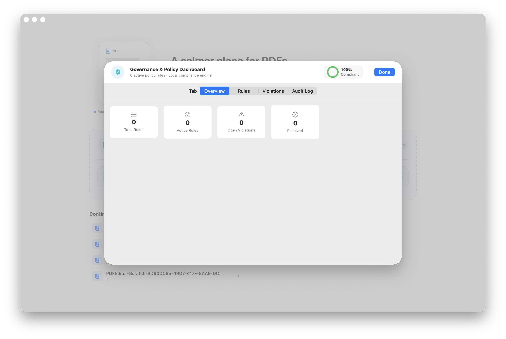
<!-- slide -->

<!-- slide -->
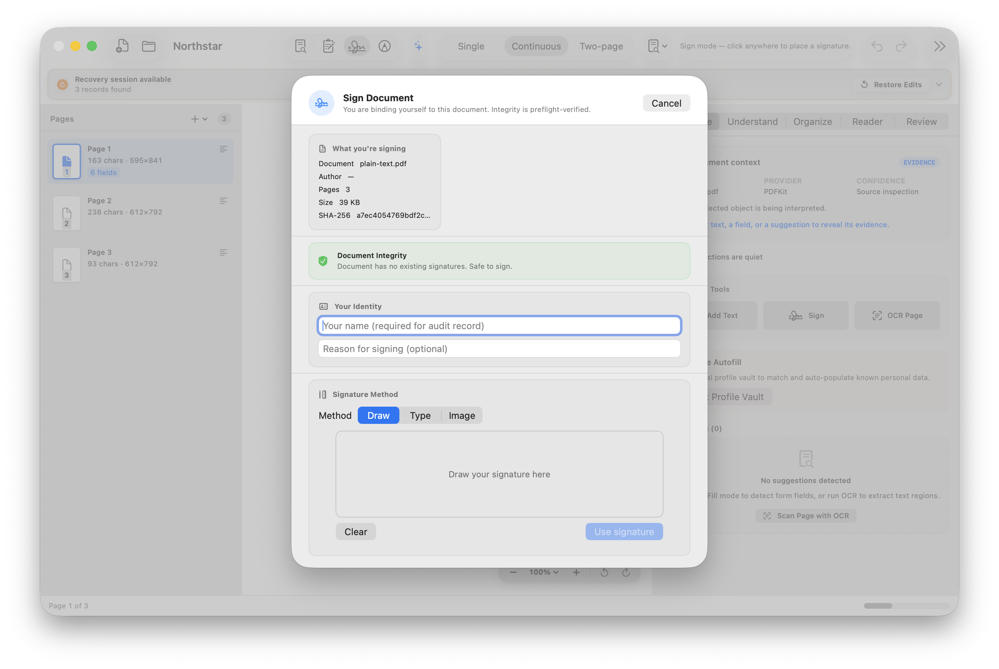
````

---

## Screen 17: Multipage Navigation Fixture

### 1. Before State (Baseline)


### 2. Discussion & Analysis
- **Role:** Multipage document navigation rail, layout modes (`Single`, `Continuous`, `Two-page`), reading progress bar, and per-page mutation badges.
- **Current Elements (before):**
  - Baseline screenshot was captured on the Welcome screen prior to loading a multipage document fixture.
- **Identified Friction Points & Design Opportunities:**
  1. Multipage navigation requires instant visual thumbnail cues, page dimensions, and field count badges.
  2. Reading layout controls in the toolbar must clearly indicate active reading mode.
  3. Window footer must provide exact page coordinate awareness and reading progress.

### 3. Changes Implemented
- **Multipage Thumbnail Rail (`PageThumbnailRailView.swift`)**:
  - Dedicated sidebar header with "Pages" title, insert page menu (`+`), and capsule total page badge (`3`).
  - Active page highlight card with continuous corners, dog-eared thumbnail glyph, character count, page dimensions (`595×841`), and field count badge (`6 fields`).
  - Contextual menu on each page card for reordering and deletion.
- **Reading Layout & Zoom Controls**:
  - Segmented reading layout picker (`Single`, `Continuous`, `Two-page`) in the window toolbar.
  - Floating `.regularMaterial` glass zoom controller (`- 100% + ↺ ↻`) centered at the bottom of the canvas.
  - Reading progress footer with bold page counter (`Page 1 of 3`) and reading progress indicator bar.
- **Code Location**: `Sources/PDFEditorApp/PageThumbnailRailView.swift` and `Sources/PDFEditorApp/ContentView.swift`.

### 4. After State & Verification

---

## Screen 18: Form Field Affordances & Smooth Thumbnail Rail Selection

### 1. Before State (Baseline Friction)
- **Thumbnail Rail Hit-Testing Glitch**: In `PageThumbnailRailView`, clicking thumbnail cards was unresponsive or sluggish unless forced on text glyphs or the thumbnail icon. Empty card padding and trailing space ignored clicks due to missing `contentShape(Rectangle())` and lack of full-width expansion (`frame(maxWidth: .infinity)`).
- **Missing Canvas Field Affordances**: When opening a document with form fields (e.g. `public-sample-form.pdf` containing 6 AcroForm fields), the thumbnail rail correctly displayed `[6 fields]`, but the document canvas drew zero highlights or affordances in default `.read` mode because `fillHighlightRegions` suppressed all highlights unless explicitly in `.fill` or `.sign` mode.

### 2. Discussion & Analysis
- **Affordance Principle**: In modern PDF readers (Apple Preview, Adobe Acrobat), interactive form fields have subtle ambient bounding boxes (tinted fill + hairline accent border) even in read mode. This visually signals to users that the document has interactive fields that can be clicked directly to fill.
- **Click Responsiveness**: A sidebar navigation list item must be 100% interactive across its entire bounding box (`maxWidth: .infinity`, `contentShape(Rectangle())`), with instant hover feedback and single-click activation.

### 3. Changes Implemented
1. **Full-Width Rail Card Hit-Testing & Hover Feedback (`PageThumbnailRailView.swift`)**:
   - Extracted `PageThumbnailCardView` with `@State private var isHovered = false`.
   - Added `Spacer(minLength: 0)` and `.frame(maxWidth: .infinity, alignment: .leading)` so each card occupies the full width of the rail.
   - Applied `.contentShape(RoundedRectangle(cornerRadius: 8))` ensuring 100% of the card area captures single light clicks.
   - Added subtle hover highlight (`Color.primary.opacity(0.05)`) and hairline border (`Color.primary.opacity(0.12)`) on mouse-over.
2. **Ambient Form Field Affordances in Read & Edit Modes (`AppModel.swift`)**:
   - Updated `fillHighlightRegions` in `Sources/PDFEditorRecovery/AppModel.swift` to return detected native fields and candidates even when `editorMode == .read` or `.edit`.
   - Native fields render with `.nativeField` state (`NSColor.systemBlue.withAlphaComponent(0.08)` fill and `NSColor.controlAccentColor` stroke).
   - In `.read` mode, field chips remain quiet unless focused, giving a calm document view without distracting tag clutter, while clicking any field immediately engages `.fill` mode and focuses the field for inline editing.

### 4. Verification & Visual Evidence

````carousel
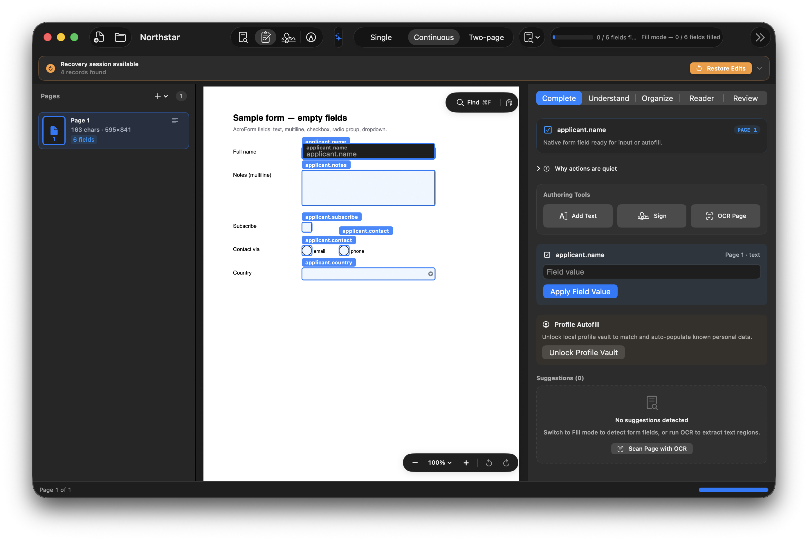
<!-- slide -->
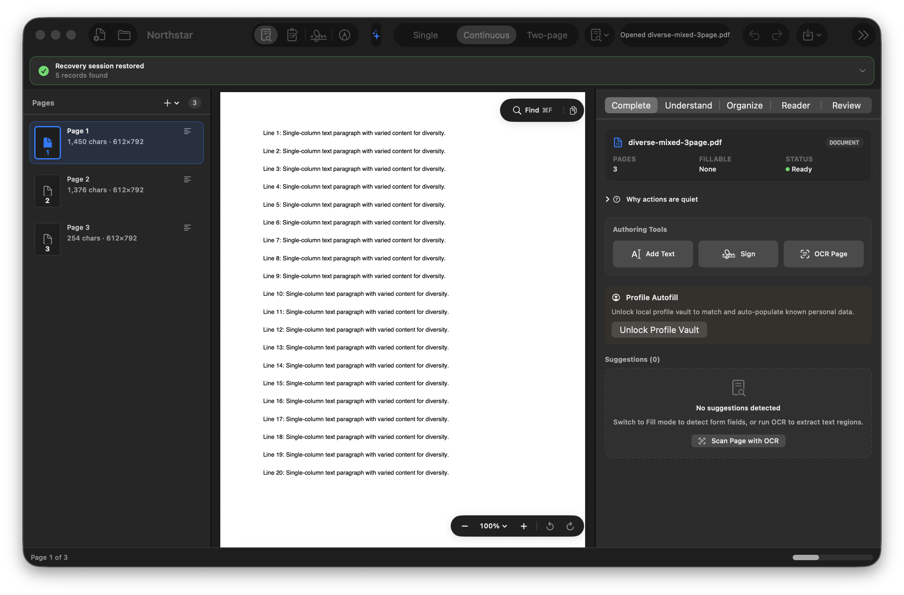
<!-- slide -->
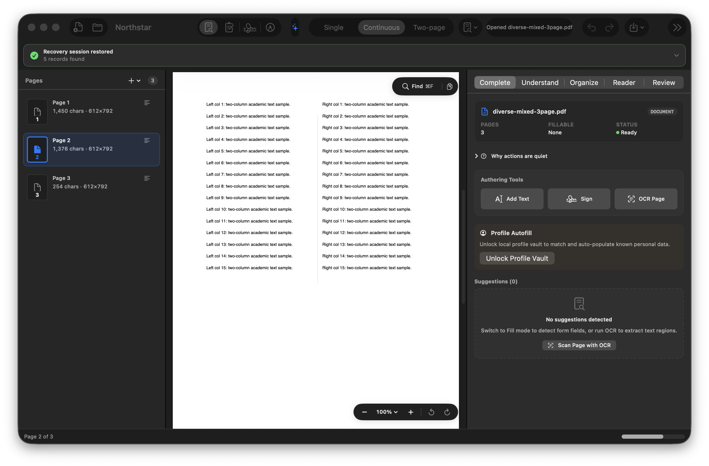
<!-- slide -->
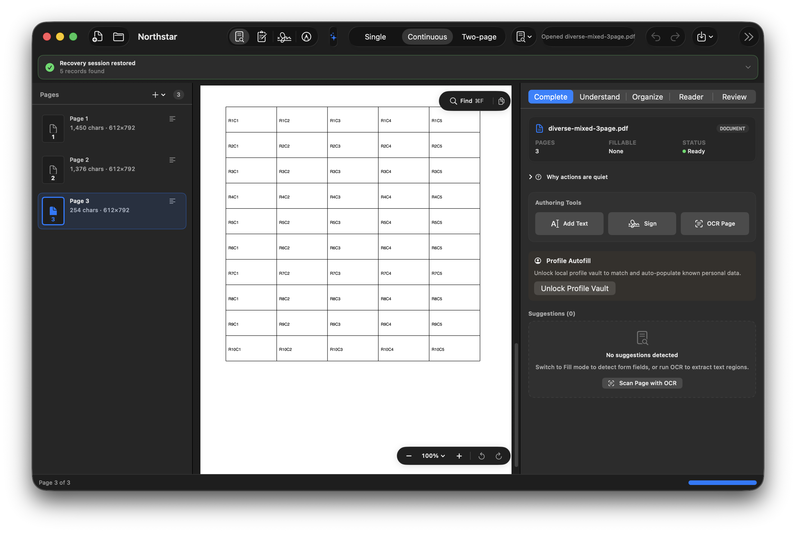
````

---

## Screen 19: Contextual Inspector First-Principles Redesign & Adaptive Morphing

### 1. Before State (Baseline Friction)
- **False Dichotomy**: Early proposals suggested either pinning a permanent document header (wasting vertical screen space when an item was selected) or completely clearing the inspector when nothing was selected (leaving dead space and no document-level posture).
- **Epistemic Layer Pollution**: Internal engine telemetry (`PROVIDER: Apple PDFKit`, `Pipeline Mode: Standard Bridge`, hashes, OCR confidence) was splattered directly into the top card of the `Complete` authoring tab, creating cognitive fatigue for users who simply wanted to fill a form.
- **Fragmented Focus**: Clicking a form field on canvas drew an inline editor, but the inspector sidebar remained divided between a redundant top document card and a distant property box at the bottom.

### 2. First-Principles Deconstruction & Architecture Discovery
- Grounded directly in `OPERATING_DOCTRINE.md` (§2 Epistemic Depth, §8 Capability Routing, §10 Interface & Density) and `EXPLORATION_DOCTRINE.md` (authored in `docs/explorations/contextual_inspector_first_principles_exploration.md`).
- Deconstructed the inspector into 4 human-computer primitives:
  1. **Scope Primitive**: Document Scope (Global) vs Entity Selection (Local).
  2. **Epistemic Depth**: Tier 1 (Actionable Surface) vs Tier 2 (Semantic) vs Tier 3 (Cryptographic & Engine Provenance).
  3. **Cognitive Postures**: `Complete` (Authoring) vs `Review` (Forensic Integrity & Preflight).
  4. **Density Primitive**: Adaptive focus with smooth spring transitions.
- **The Converged Architecture**:
  - **State A (`Selection == None`)**: Document Overview Card + Quick Actions (`Add Text`, `Sign`, `OCR Page`) + **Interactive Detected Fields Navigator** (clickable field list with status badges).
  - **State B (`Selection == Field/Candidate/Annotation`)**: Smooth spring-animated morph into a dedicated **Field Property Inspector** with a `‹ Document` back button to return to document scope.
  - **Telemetry Relocation**: Technical engine diagnostics (`Engine & Execution Provenance`, pipeline modes, and AcroForm parsing statistics) moved to their true epistemic home: the **`Review`** tab.

### 3. Changes Implemented
1. **Adaptive Morphing Container (`ContextualInspectorView.swift`)**:
   - Replaced the split rail with an adaptive conditional block morphing between Document Scope and Selection Scope with spring animation (`.animation(.spring(response: 0.35, dampingFraction: 0.82))`).
2. **Interactive Detected Fields Navigator (`detectedFieldsNavigator`)**:
   - Lists all detected form fields with status icons (checked for filled, open circle for unfilled), field name, kind tag (`text`, `choice`, `button`), and current value / "Unfilled" capsule badge.
   - Single-clicking any row immediately selects the field, scrolls the canvas, and morphs the inspector into that field's focused property view.
3. **Dedicated Field Context Card with Back Navigation**:
   - Added a `‹ Document` capsule button at the top of `selectedNativeFieldContextCard`, `selectedCandidateContextCard`, and `selectedAnnotationContextCard`.
   - Clicking `‹ Document` deselects the active entity and returns the inspector to Document Scope.
4. **Engine Provenance Relocation to Review Tab**:
   - Moved all rendering provider diagnostics into a clean, dedicated `Engine & Execution Provenance` card inside `trustTabContent` (`Review` tab).
   - Shows active rendering provider (`Apple PDFKit Native Engine` or `Custom Metal/CoreGraphics Pipeline`), pipeline mode, native field AcroForm counts, and candidate detections.

### 4. Verification & Visual Evidence

````carousel
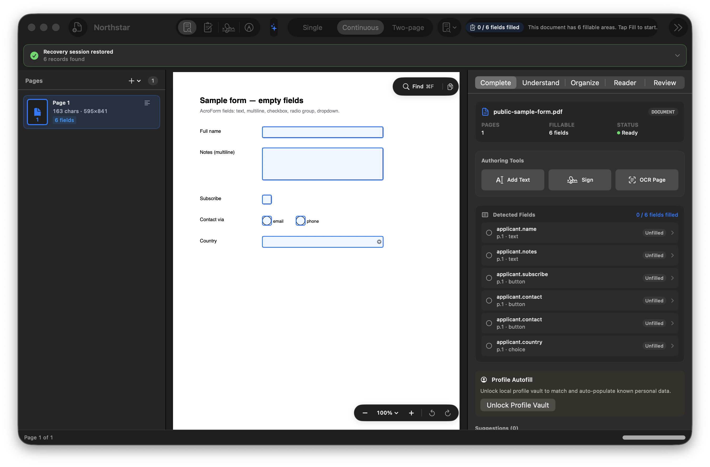
<!-- slide -->
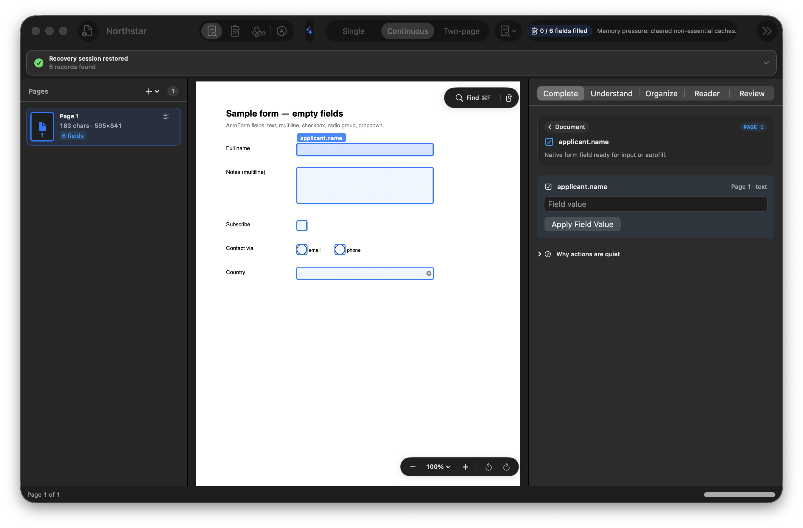
<!-- slide -->
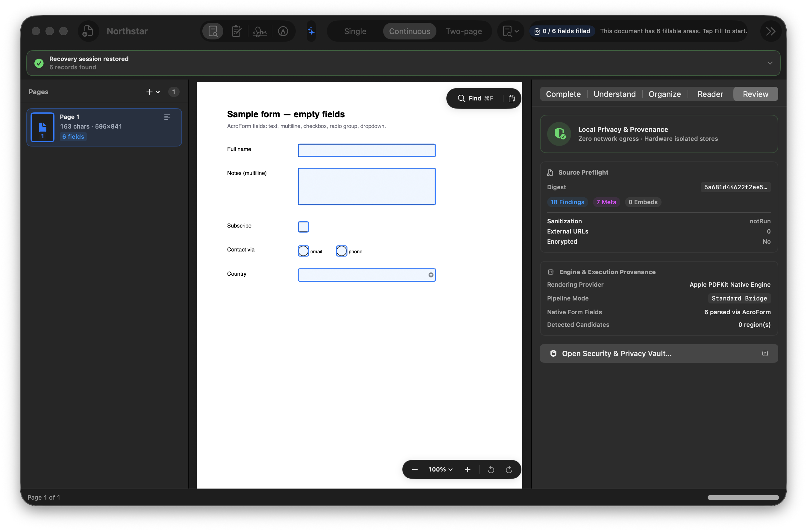
````

---

