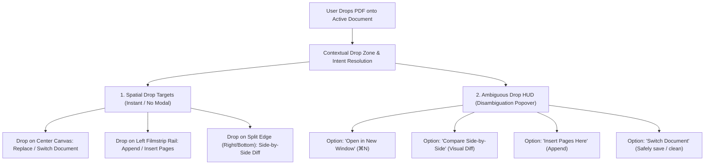

# Exploration Map & Research: Multi-Document Drop & Ingestion UX

> **Status:** Exploration & Research Doctrine Phase  
> **Topic:** In-Session File Drop, Multi-Document Ingestion, and Disambiguation UX  
> **Target Surface:** `DocumentCanvasView`, `ContentView`, `PDFEditorApp`  

---

## 1. Negative Space & The Core Problem

### The Current Behavior (The "Dead Canvas" Drop Problem)
* **Welcome Workspace:** Implements a global `.onDrop(of: [UTType.pdf.identifier], ...)` handler. Users can drag and drop a PDF file from Finder directly into the window.
* **Active Document Workspace:** The moment a document is loaded, **the drop target disappears completely**. If a user drags another PDF onto the active canvas, macOS displays the disabled "no-drop" cursor ($\oslash$). 
* **The Cognitive Friction:** To compare another version, open a second invoice, or append pages, the user must either:
  1. Manually open Finder, find the file, right-click, and choose "Open With...".
  2. Or use the File menu (`⌘N` for a new window, then drag into that new window).
  3. Or use the Batch Merge sheet buried in the Export toolbar.

### Negative Space Analysis
Why can't an active document workbench accept incoming files? 
In physical reality, if you are sitting at a drafting desk with a document open, dropping another paper onto your desk does not erase your current document or bounce off an invisible wall. You either:
1. **Place it side-by-side** to compare them.
2. **Stack it** on top as a new task or tab.
3. **Attach / Append** it to the current work.
4. **Switch focus** to the new document.

---

## 2. Exploration Map: The Ingestion Decision Matrix



---

## 3. Five Dimensional Exploration Frontiers

### Frontier A: Spatial Drop Zones (Direct Manipulation)
Rather than interrupting the user with a modal dialog ("What do you want to do?"), modern Mac applications (such as Xcode, Final Cut Pro, Craft, and Safari) use **spatial target regions** during drag-hover:

1. **Drop on the Thumbnail Rail (Left Sidebar):**
   - **Visual Cue:** A blue insertion line appears between thumbnails.
   - **Action:** Inserts the dropped PDF's pages directly into the current document at that exact index (`model.insertPages(from:at:)`).
2. **Drop on the Canvas Split Edge (Right 30% of canvas):**
   - **Visual Cue:** A translucent split-screen preview card illuminates (`Split & Compare`).
   - **Action:** Opens the visual diff comparison engine side-by-side with the current document.
3. **Drop on the Center Canvas Desk:**
   - **Visual Cue:** Prompts with a sleek floating glass action sheet or triggers the Disambiguation HUD.

### Frontier B: The "Active Work" Protection Invariant
A critical doctrine rule is **non-destructive preservation**:
* **If the current document is DIRTY (has unsaved edits/annotations):**
  - Northstar MUST NOT silently replace the active document.
  - The drop HUD must offer:
    - `"Open in New Window"` (Default / Recommended)
    - `"Compare with Current"`
    - `"Save & Switch"`
    - `"Cancel"`
* **If the current document is CLEAN (unmodified):**
  - Can safely switch documents, or spawn a new window if the user holds `Option (⌥)`.

### Frontier C: Multi-Window & Tab Ecosystem
* macOS natively supports `NSWindow` tabs (`Window > Merge All Windows`).
* If Northstar spawns a new window for the dropped document, macOS can either present it as an independent window or an adjacent tab based on the user's system preferences (`System Settings > Desktop & Dock > Prefer tabs when opening documents`).

### Frontier D: Visual Diff & Version Comparison Integration
* When a user is reviewing an updated contract (e.g. `contract_v2.pdf` while `contract_v1.pdf` is open), dropping `v2` directly onto `v1` is the single most natural gesture to trigger **Version Compare**.
* The HUD can automatically detect filename similarity (Levenshtein distance or shared prefix) and highlight:
  > *"Looks like a new revision of this document! Compare changes side-by-side?"*

---

## 4. Mac HIG & Apple Design Alignment

According to Apple's Human Interface Guidelines on Drag and Drop:
1. **Provide Clear Visual Feedback:** During a drag, the target view should highlight to indicate it is ready to accept the item.
2. **Preserve User Intent:** Do not perform destructive replacements on drops without confirmation.
3. **Modifier Keys:** Standard Mac convention:
   - Plain Drop: Contextual default (Prompt or Split).
   - `⌥ (Option) + Drop`: Duplicate / Open in New Window.
   - `⌘ (Command) + Drop`: Insert / Append to current file.

---

## 5. Architectural Implementation Blueprint

To implement this without cluttering the codebase:

### 1. In `ContentView.swift` (`inspectionContent`):
Add `.onDrop(of: [UTType.pdf.identifier], isTargeted: $isDocumentDropTargeted, perform: handleDocumentDrop)` to the active workspace container.

### 2. Introduce `DocumentDropIntentSheet`:
A lightweight, modern macOS sheet / popover attached to the drop location:
```swift
struct DocumentDropDisambiguationView: View {
  let incomingURL: URL
  let currentURL: URL?
  let onOpenNewWindow: () -> Void
  let onCompareSideBySide: () -> Void
  let onAppendPages: () -> Void
  let onSwitchDocument: () -> Void
  let onCancel: () -> Void
}
```

### 3. Quick Action Matrix on Drop:
| User Gesture / Zone | Target Action | Behavior |
| :--- | :--- | :--- |
| **Drop on Page Rail** | `insertPages` | Appends or merges pages into current PDF |
| **Drop on Main Canvas** | `showDropDisambiguation` | Presents glass HUD: New Window / Compare / Switch |
| **Drop with `⌥` held** | `openInNewWindow` | Instantly spawns a new window without asking |

---

## 6. Recommendations & Next Steps

1. **Phase 1 (Immediate UX Quality):**
   - Fix the Welcome workspace titlebar so Mac **traffic light controls** are permanently visible.
   - Remove the **developer telemetry** (`PROVIDER: PDFKit`, `CONFIDENCE: Source inspection`) from the Contextual Inspector and replace it with a clean document overview.
2. **Phase 2 (Drop Ingestion Exploration):**
   - Wire the canvas drop target to display the lightweight **Drop Disambiguation HUD** whenever a PDF is dragged onto an open document.
