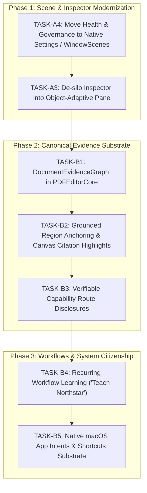

# Execution Plan: ChatGPT Architectural Review Task Implementation

> **Date:** September 2026  
> **Authority:** `OPERATING_DOCTRINE.md` (v8.0), `ARCHITECTURE_DOCTRINE.md`, `EXPLORATION_DOCTRINE.md`  
> **Source Task Matrix:** `docs/reviews/chatgpt_architectural_review_task_matrix.md`  
> **Preservation Constraints:** Zero Git mutations, local-first on-device execution, zero network egress, preserve all existing working tree edits.

---

## 1. Executive Objective

Transform Northstar from a tool-centric PDF viewer with separate "rooms" into a consequential **local-first document work system** powered by:
1. **Object-Adaptive Inspector (TASK-A3):** Auto-morphing inspector when text/clauses, tables, candidates, or fields are active.
2. **Native Mac Scene & Settings Architecture (TASK-A4):** Relocating Companion Health & Governance Dashboard into native Settings and secondary Windows, pruning ephemeral modal sheet clutter from `ContentView`.
3. **Canonical Document Evidence Graph Substrate (TASK-B1):** A typed, navigable graph unifying elements, index, layout, tables, entities, and citations without disconnected AI shadow stores.
4. **Grounded Intelligence with Region Anchoring (TASK-B2):** Citation-anchored assertions linked to physical document coordinates with visual canvas highlights.
5. **Transparent Capability Routing (TASK-B3):** Real-time verifiable route disclosures (`● On-device (Neural Engine)`).
6. **Recurring Workflow Memory (TASK-B4):** Productizing template and profile calibration into a 1-click "Teach Northstar" workflow.
7. **Native macOS App Intents & Shortcuts (TASK-B5):** Native system integration for Sanitization, Table Extraction, OCR, and Version Comparison.

---

## 2. Phased Architecture & Execution Order



---

## 3. Detailed Task Specifications

### [TASK-A4] Relocate Diagnostics & Governance into Native Settings / Multi-Window Scenes
- **Changes:**
  1. Enhance `SettingsView` with tabbed architecture:
     - Tab 1: **General** (Document Opening, Adaptive Commands, Safety, Appearance)
     - Tab 2: **Governance** (Policy Rules, Violations, Compliance status via `GovernanceEngine`)
     - Tab 3: **Diagnostics & Health** (Companion Health, Provider Status, Egress Gate, Bridge Log)
  2. Register native `Window` scenes in `PDFEditorApp.swift`:
     - `Window("Governance Dashboard", id: "governance-dashboard")`
     - `Window("Diagnostics & Companion Health", id: "diagnostics-window")`
  3. Replace sheet presentation toggles in `ContentView.swift` with native window open actions (`openWindow(id:)`), drastically decluttering modal stack.

### [TASK-A3] Object-Adaptive Inspector
- **Changes:**
  1. Add `selectedTextSelection: (text: String, bounds: PDFRect, pageIndex: Int)?` to `AppModel`.
  2. In `ContextualInspectorView.swift`:
     - Display **Text / Clause Selection Card** when text is selected (Summarize, Extract Obligations, Redact Selection, Copy Clean Text).
     - Display **Table Selection Card** when table is detected or focused (CSV / JSON export, row inspection, math totals).
     - Display **Candidate / Field Card** when candidate region or form field is active.
     - Global tabs remain accessible, but the primary view dynamically defaults to the active object context.

### [TASK-B1] Canonical Document Evidence Graph Substrate
- **File:** `Sources/PDFEditorCore/DocumentEvidenceGraph.swift`
- **Specification:**
  - Nodes: `DocumentNode`, `PageNode`, `SectionNode`, `ClauseNode`, `TableNode`, `FieldNode`, `EntityNode`, `SignatureNode`.
  - Edges: `contains`, `references`, `derivedFrom`, `boundsOverlap`, `conflictsWith`.
  - Physical Anchors: `PDFPageRegion` linking every node to source document SHA-256 and canvas geometry.

### [TASK-B2] Grounded Intelligence with Region Anchors
- **Specification:**
  - `GroundedQueryResult` with `citations: [EvidenceCitation]`.
  - Each citation carries a `PDFPageRegion`.
  - Selecting citation in UI flash-highlights the physical canvas region (`model.flashHighlight(region)`).

### [TASK-B3] Verifiable Capability Route Disclosures
- **Specification:**
  - `CapabilityRouteDisclosure` showing:
    - Route: `.onDeviceNeuralEngine`, `.applePrivateCloudCompute`, or `.hostedProvider`.
    - Egress State: Zero Network Egress guaranteed.
    - Hardware Accel: Apple Silicon ANE.

### [TASK-B4] Recurring Workflow Memory ("Teach Northstar")
- **Specification:**
  - Add "Teach Northstar This Workflow" button to `ContextualInspectorView`.
  - Captures layout geometry, candidate mappings, and user edits into encrypted `ProfileStore` and `TemplateCaptureContracts`.

### [TASK-B5] Native macOS App Intents & Shortcuts Substrate
- **File:** `Sources/PDFEditorApp/PDFEditorAppIntents.swift`
- **Specification:**
  - `SanitizePDFIntent`: Strip metadata, sanitize streams, export verified copy.
  - `ExtractTableCSVIntent`: Run on-device table extraction and output CSV.
  - `ComparePDFVersionsIntent`: Generate visual diff report between two PDFs.

---

## 4. Canvas-to-Sidebar Page Scroll Synchronization [Defect Resolution & Architecture]

### Problem Analysis & Root Cause Exploration:
- **Observed Defect:** Scrolling through continuous pages on the document canvas does not cause the sidebar page rail to track, scroll, or update its selected page indicator.
- **First Principles Investigation (`EXPLORATION_DOCTRINE.md`):**
  1. In `DocumentCanvasView.swift`: `installProjectionObservers(for:)` attempted to locate `view.enclosingScrollView?.contentView`. However, in AppKit's `PDFKit`, `PDFView` is **not** enclosed inside an `NSScrollView`; rather, `PDFView` embeds an internal `PDFScrollView` as a child subview (`view.subviews.compactMap { $0 as? NSScrollView }.first`).
  2. Because `view.enclosingScrollView` returned `nil`, `scrollContentView` remained `nil`. No `NSView.boundsDidChangeNotification` was ever registered on the active clip view (`PDFClipView`).
  3. Continuous smooth scrolling in `PDFView` does not reliably emit `.PDFViewPageChanged` notifications (which are reserved for discrete navigation events). It emits `NSView.boundsDidChangeNotification` on its clip view and `PDFViewVisiblePagesChangedNotification`.
  4. Even in the bounds observer, the coordinator previously only called `invalidateOverlay()` without evaluating visible page index transitions.
- **Architectural Solution:**
  1. Dynamically discover the internal scroll view:
     ```swift
     let internalScrollView = view.subviews.compactMap { $0 as? NSScrollView }.first ?? view.enclosingScrollView
     let scrollContentView = internalScrollView?.contentView
     ```
  2. Register `NSView.boundsDidChangeNotification` on `scrollContentView` with `postsBoundsChangedNotifications = true`.
  3. Register `Notification.Name("PDFViewVisiblePagesChanged")`.
  4. Create `handleViewportOrPageChange()` to sample `view.currentPage` (falling back to `view.page(for: centerPoint, nearest: true)`).
  5. When the predominant visible page changes, update `lastNavigatedPageIndex`, fire `onVisiblePageChanged?(pageIndex)` which updates `model.selectedPageIndex`.
  6. Because `lastNavigatedPageIndex` matches the new index, `updateNSView` will not invoke redundant `view.go(to:)` calls, eliminating feedback loops and scroll stutter.
  7. The sidebar's `ScrollViewReader` receives `model.selectedPageIndex` and smoothly scrolls (`proxy.scrollTo(newIndex, anchor: .center)`) while highlighting the active page card.

